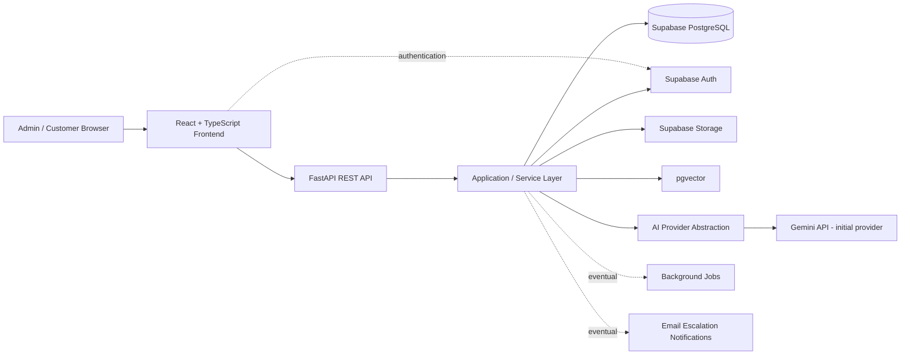
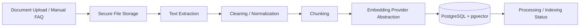
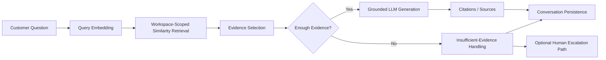
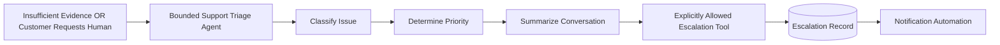
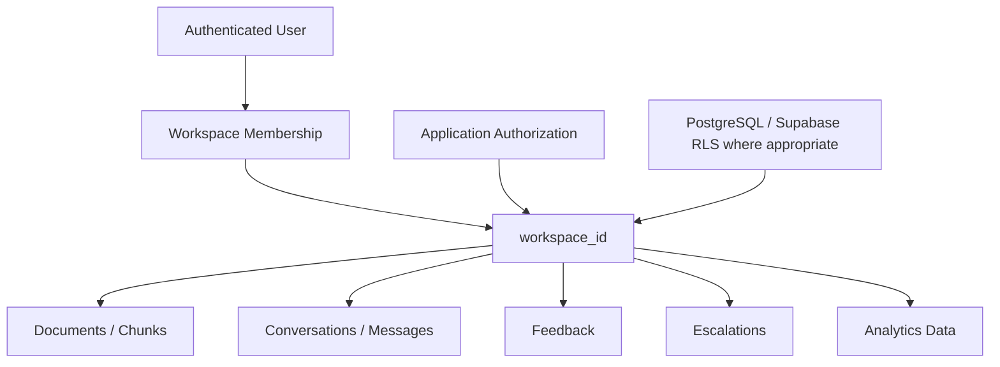

# SupportPilot AI — Architecture

## Architecture goals

SupportPilot AI should use a simple, maintainable architecture suitable for a professional portfolio project. The design must preserve strong tenant isolation, grounded RAG answers, replaceable AI providers, and a bounded agent model without introducing unnecessary enterprise complexity.

## High-level application architecture

### Responsibilities

- **React frontend:** admin and customer interfaces, client-side interaction, streaming response UX, and authenticated application flows.
- **FastAPI REST API:** trusted backend boundary for validation, authorization, orchestration, and external API behavior.
- **Application/service layer:** business rules, workspace scoping, RAG orchestration, document processing, conversation handling, escalation logic, and provider abstractions.
- **Supabase PostgreSQL:** relational application data.
- **Supabase Auth:** identity and authentication.
- **Supabase Storage:** uploaded source documents.
- **pgvector:** workspace-scoped vector storage and similarity retrieval.
- **AI provider abstraction:** isolates model-provider-specific generation and embedding logic so providers/models remain configurable and replaceable.
- **Background jobs:** introduced only when needed for document processing or other asynchronous work and only after rechecking a suitable free tier.
- **Email notifications:** introduced later for escalation automation only after verifying a suitable zero-cost option.

## RAG ingestion flow

### Ingestion principles

- Processing must preserve `workspace_id` ownership.
- File type and input validation should happen before processing.
- Extracted text should be cleaned before chunking.
- Chunk metadata should retain enough source information to support later citations.
- Embeddings are generated through an abstraction layer; Gemini embeddings are the initial zero-cost default, not a permanent architectural dependency.
- Raw secrets or privileged storage credentials must never be exposed to the frontend.

## RAG question flow

### Question-answering principles

The normal support Q&A path is RAG, not an autonomous agent.

1. Embed the customer query.
2. Retrieve relevant chunks only from the correct workspace.
3. Select and evaluate evidence.
4. Determine whether available evidence is sufficient.
5. Generate only a grounded answer from approved evidence.
6. Return relevant source citations.
7. Persist the conversation and answer metadata.

When evidence is insufficient, the system should not fabricate an answer. It should return an appropriate fallback and offer or trigger escalation where applicable.

## Escalation agent flow

The Support Triage Agent is intentionally bounded. It may inspect only the conversation and context it is explicitly given and invoke only explicitly allowed escalation actions. It must not receive unrestricted database, shell, internet, or infrastructure access.

## Multi-tenancy and isolation

Major business-owned entities will use `workspace_id` so every business's content can be scoped consistently.

Workspace isolation must be enforced at multiple layers:

- application authorization and service-layer queries must scope access by `workspace_id`;
- retrieval must never search embeddings from another workspace;
- storage paths and document ownership should be workspace-aware;
- PostgreSQL/Supabase Row Level Security should be used where appropriate as defense in depth;
- privileged credentials must remain backend-only;
- tests should explicitly verify cross-workspace isolation.

## Provider abstraction

Generation and embeddings should be called through application interfaces rather than directly throughout feature code. Initial defaults are Gemini free-tier models, but configuration should make provider/model replacement possible without rewriting the RAG or application layers.

## Database scope for this phase

This architecture intentionally does **not** define the complete database schema. Tables, columns, indexes, RLS policies, and migrations will be designed in a later focused task after the application foundation and authentication requirements are ready.
