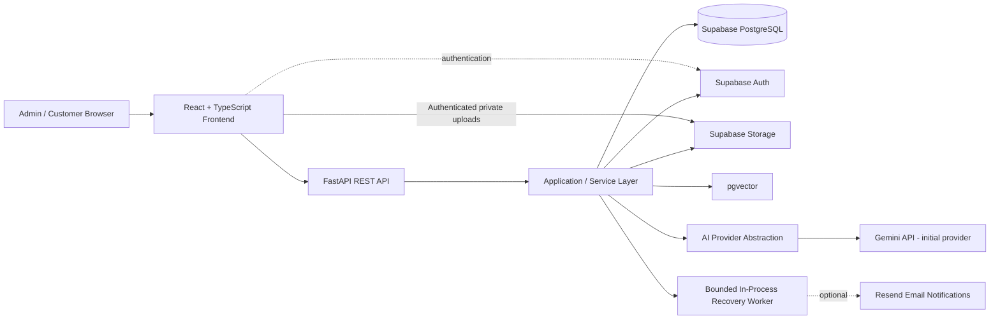
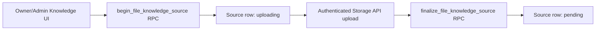
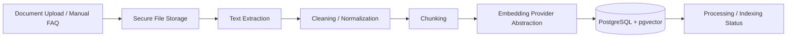
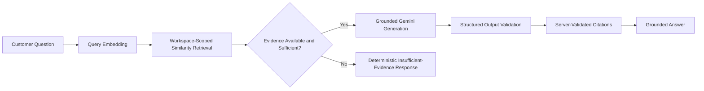
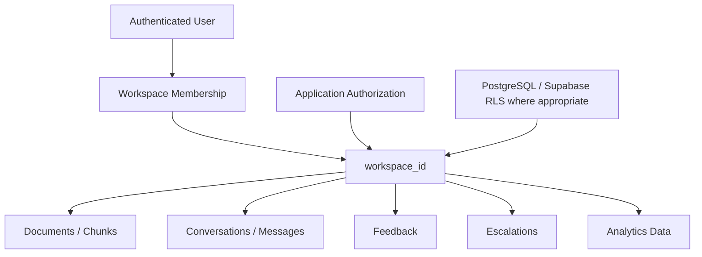

# SupportPilot AI — Architecture

## Architecture goals

SupportPilot AI should use a simple, maintainable architecture suitable for a professional portfolio project. The design must preserve strong tenant isolation, grounded RAG answers, replaceable AI providers, and a bounded agent model without introducing unnecessary enterprise complexity.

## High-level application architecture

### Responsibilities

- **React frontend:** admin and customer interfaces, client-side interaction, streaming response UX, and authenticated application flows.
- **FastAPI REST API:** trusted backend boundary for validation, authorization, orchestration, and external API behavior.
- **Application/service layer:** business rules, workspace scoping, RAG orchestration, document processing, conversation handling, escalation logic, and provider abstractions.
- **Supabase PostgreSQL:** relational application data.
- **Supabase Auth:** identity and authentication.
- **Supabase Storage:** uploaded source documents.
- **pgvector:** workspace-scoped vector storage and similarity retrieval.
- **AI provider abstraction:** isolates model-provider-specific generation and embedding logic so providers/models remain configurable and replaceable.
- **Background automation:** a bounded FastAPI lifespan worker, with durable work state and eligibility in PostgreSQL rather than an external paid queue.
- **Email notifications:** optional deterministic Resend integration after checking its Free plan; no provider credentials are required to run the app.

## Authentication and workspace foundation

Supabase Auth is the identity provider. A reusable frontend auth provider restores the Supabase-managed session, subscribes to auth changes, and protects `/app` routes without separately storing access tokens. Registration passes `display_name` as user metadata so the existing database trigger owns profile creation. Login, email-confirmation-required, and logout states are handled explicitly.

Browser code uses only the project URL and publishable key. After sign-in, the workspace provider reads `workspaces` through RLS and creates a workspace only through `create_workspace(workspace_name)`. A selected workspace ID may be stored locally for convenience, but it is always revalidated against the currently accessible RLS result and is never treated as authorization.

Authenticated FastAPI requests flow through one API client that applies the active session's bearer token. The backend authentication dependency:

- verifies ES256/RS256 tokens with the project's JWKS endpoint and cached signing keys;
- fixes the accepted algorithms, issuer, `authenticated` audience, expiration, and subject requirements;
- uses Supabase Auth's user endpoint with the publishable key for legacy HS256 projects that cannot be verified by JWKS;
- returns only the verified user ID and optional email from `/api/auth/me`.

No JWT signing secret is requested or stored. `SUPABASE_SECRET_KEY` is not part of ordinary auth, workspace, Knowledge Base, or business RAG request handling. Phase 5A uses it inside a narrow server-side customer-chat RPC gateway because anonymous customers have no Supabase identity; Phase 6 adds separate gateways restricted to four triage and four notification lifecycle/listing RPCs. There is no generic privileged query client.

The initial Phase 2A data model contains only:

- `profiles`, keyed directly to `auth.users.id`;
- `workspaces`, with a recorded creator;
- `workspace_members`, with one `owner`, `admin`, or `member` role per user/workspace pair.

Every table has RLS enabled plus explicit grants and operation-specific policies. Private `SECURITY DEFINER` helpers check the caller's membership or owner role without recursively invoking membership policies. They derive identity from `auth.uid()`, use an empty fixed `search_path`, and expose no caller-supplied user-ID authority.

Workspace creation uses one narrowly scoped RPC. It validates the name, inserts the workspace, and creates the authenticated caller's owner membership atomically. Direct client writes to membership roles are not allowed in this phase.

## Knowledge-source storage foundation

Phase 3A introduces `knowledge_sources` as the workspace-owned record for uploaded files and manual FAQs. It records only source metadata/content needed at this stage—never uploaded binary data or embeddings. Statuses cover `uploading`, `pending`, `processing`, `ready`, and `failed`; Phase 3A creation flows stop at `pending` so the UI never implies that unprocessed material is ready for retrieval.

File uploads use this controlled sequence:

The database generates the creator, source UUID, status, and object path. Objects live in the private `knowledge-files` bucket under `<workspace-id>/<source-id>/<source-id>.<ext>`, are capped at 10 MB, and accept PDF, DOCX, TXT, or Markdown MIME types. Uploads use `upsert: false`; no Storage UPDATE policy exists, so object overwrite is unavailable.

Workspace owners and admins can initialize uploads, add FAQs, and remove failed-upload objects. Members can read permitted source metadata and private objects but cannot create, upload, update, or delete. Non-members have no access. Storage policies authorize an exact trusted source path through workspace membership rather than object ownership or caller-provided paths.

Failed uploads attempt Storage API cleanup before the narrowly scoped cancel RPC removes an `uploading` row. Cleanup checks both Supabase error results and thrown failures; metadata is never canceled unless object removal is explicitly confirmed. If finalization fails after a successful upload, the client makes exactly one recovery call and never reuploads or overwrites the object.

The recovery RPC accepts only a source UUID, derives workspace/status/path from a locked row, and authorizes the caller as that workspace's owner/admin. It checks only the exact trusted path in the private bucket. An existing object moves `uploading` to `pending`; an absent object removes only that stale row. An already-`pending` source with its exact object can be confirmed without mutation, making a lost finalize response idempotent. Other non-uploading states fail closed. Retained `uploading` rows expose a manager-only **Recover upload** action. General source deletion remains deferred because browser-side deletion across Storage and PostgreSQL cannot be made atomic without introducing a misleading partial-delete workflow.

## RAG ingestion flow

Phase 3B implements deterministic extraction and chunk storage. Phase 3C completes ingestion with provider-abstracted embeddings and atomic pgvector indexing. Both protected FastAPI endpoints accept only a source UUID. The internal auth context retains the already-verified user access token without serializing, logging, or persisting it. A narrow gateway calls lifecycle RPCs using the publishable key plus that user's bearer token; no secret-key client is used.

`begin_knowledge_extraction` locks the source, derives its workspace, authorizes an owner/admin, moves `pending` or `failed` to `processing`, and rejects a second request unless the prior attempt is over 15 minutes old. File bytes are held in memory and hard-limited to 10 MB. PDFs require a valid signature, are rejected when encrypted or over 300 pages, and preserve 1-based page locators. OCR is not included, so scanned/image-only PDFs fail with no extractable text. DOCX parsing first validates the ZIP container (2,000 entries, 50 MB total expansion, 20 MB per member), rejects traversal, encrypted/macro/embedded-active content and XML entity declarations, then extracts paragraphs and tables in structural order. TXT/Markdown are UTF-8-only and preserve line ranges. FAQs use canonical question/answer text without Storage access.

Normalization uses Unicode NFC, stable newline/whitespace handling, control-character removal, and preserved block boundaries. Deterministic character/paragraph-aware chunking targets 1,400 characters, caps chunks at 2,000 characters (below the 2,200-character database ceiling), and uses up to 180 characters of overlap when it fits. Oversized blocks prefer sentence and word boundaries before a hard character split. Every chunk receives a zero-based index, lowercase SHA-256 digest, exact character count, and an aggregated locator: PDF pages, DOCX structural blocks, text/Markdown lines, or FAQ kind.

`complete_knowledge_extraction` validates the entire JSON chunk set before atomically replacing prior chunks and returning the source to `pending`; that state means extracted and awaiting indexing. Phase 3C's indexing RPC locks the source, returns the complete trusted chunk set in order, and records an explicit indexing stage. Gemini Embedding 2 receives only normalized text and title metadata formatted according to its current retrieval-document guidance, in bounded batches, with 768-dimensional responses checked for count, type, finiteness, and size. Completion rechecks every chunk SHA-256 token and atomically writes all vectors plus the `ready` source metadata. `ready` means all current chunks were successfully embedded. Any failure retains the extracted chunks and uses an indexing-only retry path. Workspace members may read chunks through RLS, while browser roles cannot read or modify raw embeddings.

### Ingestion principles

- Processing must preserve `workspace_id` ownership.
- File type and input validation should happen before processing.
- Extracted text should be cleaned before chunking.
- Chunk metadata should retain enough source information to support later citations.
- Embeddings are generated through an abstraction layer; Gemini embeddings are the initial zero-cost default, not a permanent architectural dependency.
- Raw secrets or privileged storage credentials must never be exposed to the frontend.

## RAG question flow

Phase 4A implements the retrieval steps. The provider abstraction formats document chunks as `title: {title} | text: {content}` and questions as `task: question answering | query: {question}` for Gemini Embedding 2, with both sides fixed at 768 dimensions. The protected `/api/rag/retrieve` diagnostic endpoint normalizes a 2–2,000 character question, embeds it once, and calls a single user-JWT-scoped Supabase RPC.

The SQL function verifies workspace membership before searching and includes workspace, `ready` status, non-null vector, provider, model, and dimension compatibility in the ranked query itself. It orders by cosine distance using the existing HNSW index, defaults to eight matches, caps requests at twelve, and returns `1 - cosine_distance` with citation-ready content and unchanged locators. Raw embeddings remain outside the response and ordinary column grants. No answerability threshold is hard-coded because later RAG evaluation must calibrate it; Phase 4B owns evidence evaluation and grounded generation.

Phase 4B adds the protected `/api/rag/answer` endpoint without changing retrieval semantics. It calls the Phase 4A service exactly once, immediately returns a fixed insufficient-evidence message when no chunks exist, and otherwise labels ranked chunks `E1` through `E8`. Only the normalized question and at most 20,000 characters of evidence content plus minimal source metadata are passed to the replaceable generation-provider interface.

The initial implementation uses Gemini `gemini-3.8-flash` with low thinking, a 1,200-token output limit, and a Pydantic structured-output schema. Retrieved documents and the user question are serialized as JSON and explicitly treated as untrusted data. The model receives no tools, function calling, Google Search grounding, URL context, database access, or raw embeddings. Prompt-injection resistance is defense in depth rather than a mathematical guarantee.

The model may return only `answerable` with a bounded answer and request-local evidence labels, or `insufficient_evidence` with no answer or labels. No fixed cosine threshold is used: when matches exist, the model evaluates their actual content rather than answering from general knowledge. The server validates every returned label, removes duplicate references deterministically, restores retrieval order, and constructs citation titles, types, indices, UUIDs, and locators solely from trusted retrieval results. Unknown labels or malformed structured output fail safely; the model never supplies final citation metadata. Phase 5A reuses this same orchestration for anonymous customer turns.

## Customer conversation flow

```mermaid
flowchart LR
    ID[Unpredictable public chat ID] --> SESSION[Opaque seven-day customer session]
    SESSION --> TURN[Idempotent persistent customer turn]
    TURN --> CONTEXT[Bounded recent persisted context plus current question]
    CONTEXT --> EMBED[One query embedding]
    EMBED --> RET[Session-scoped knowledge retrieval]
    RET --> PREFIX[Structured Gemini stream: decision then evidence IDs]
    PREFIX --> VALIDATE[Validate request-local evidence IDs]
    VALIDATE --> DELTA[Stream decoded grounded answer text]
    DELTA --> FINAL[Final structured validation]
    FINAL --> SAVE[Atomic answer and trusted citation snapshot]
    SAVE --> HISTORY[Conversation history API]
    SAVE --> FEEDBACK[Customer rating persisted on assistant message]
    HISTORY --> HANDOFF[Confirmed human request]
    HANDOFF --> PAUSE[human_requested status blocks AI turns]
```

Phase 5A introduces one enabled chat configuration per workspace, SHA-256-only customer-session records, conversations, idempotent turns, customer/assistant messages, and historical citation snapshots. FastAPI generates at least 256 bits of token entropy, returns the raw token only once, hashes it immediately on later requests from `X-SupportPilot-Session`, and never stores or logs the raw value. A conversation is limited to 100 customer turns; messages, answers, citations, and retrieval counts are bounded. Sessions remain anonymous and collect no name, email, phone, IP address, location, or browser fingerprint. Robust public abuse/rate limiting remains Phase 8 work.

The two security paths remain deliberately separate:

- Business/admin operations use a Supabase user JWT, the publishable key, and RLS.
- Anonymous customer operations use an opaque customer session through FastAPI, a fixed allow-list customer-chat gateway, and server-only RPCs invoked with `SUPABASE_SECRET_KEY`.

The secret key bypasses RLS, so it never reaches browser code and cannot be used through a generic privileged client. Direct table privileges are withheld even from the service role. Every public-chat RPC independently derives and validates the session/workspace relationships relevant to its operation, and returns only its bounded safe result. The original member-authorized `search_knowledge_chunks` RPC is unchanged; a separate server-only retrieval RPC derives the workspace from the validated customer session and never returns vectors.

The turn-start RPC creates the processing turn and normalized customer message atomically. Its `(conversation_id, client_message_id)` uniqueness prevents duplicate customer messages and generation: completed retries return the persisted answer, processing retries return a safe conflict, and failed turns can retry without deleting their customer message. The completion RPC validates citation data against current trusted workspace chunks before atomically writing an assistant message, citation snapshots, links, and timestamps. Provider exception details are never persisted.

Phase 5B.1 adds the public `/chat/:publicId` React route outside the business authentication boundary. A dedicated frontend API client calls only session creation, conversation history, and turn submission through FastAPI; the opaque token is sent only through `X-SupportPilot-Session`. A public-ID-namespaced local-storage record contains only public ID, conversation ID, session token, expiry, and workspace name. Messages are always restored from server history rather than cached locally. Expired or rejected sessions are cleared and recreated once, while ambiguous turn failures retain the original `client_message_id` for an explicit Retry action.

Phase 5B.2 loads authoritative history only after a new or failed-retry turn begins, verifies that its final message is the normalized current customer question, and excludes exactly that message from prior context. A deterministic helper adds at most the six immediately preceding messages, newest-first within the existing 2,000-character budget, then presents selected messages chronologically with the complete current question. The composed string is used only for the existing query embedding and grounded generation path: it is never accepted from the browser, persisted, logged, returned, or produced by an extra Gemini rewrite call. Conversation text may clarify references, but it remains untrusted and cannot support factual claims or citations; only retrieved Knowledge Base chunks are evidence.

Phase 5B.3 adds one workspace-scoped feedback row per assistant message. Anonymous customers can insert or change only `positive`/`negative` feedback through a session-validated server-only RPC; workspace members receive read-only RLS access for the later admin dashboard. A separate idempotent RPC locks an open conversation, verifies the opaque session and enabled chat, records `human_requested_at`, and transitions it to `human_requested`. Existing history, citations, and feedback remain intact, while the existing turn-start guard blocks new AI turns.

Phase 5B.4 adds genuine provider streaming through the existing `google-genai` Generate Content API and provider abstraction; it does not animate a completed answer character by character and does not introduce another AI SDK. The strict schema is ordered `decision`, `evidence_ids`, then `answer`, allowing the server to fully parse and validate the decision and request-local labels before exposing any decoded answer text. The incremental parser handles arbitrary chunk boundaries and JSON escapes without regex-based extraction. It accumulates the complete JSON for mandatory final Pydantic validation, confirms the final decision, canonical evidence IDs, and answer exactly match the streamed values, then reconstructs citations only from the retrieved metadata.

The streaming customer endpoint is `POST /api/chat/conversations/{conversation_id}/turns/stream` with the existing `X-SupportPilot-Session` credential and request body. Its minimal SSE contract is `started`, zero or more `delta` events, then one authoritative `complete`, or a safe `error` after headers. Retrieval and turn preparation occur before the response starts. A completed idempotent replay emits only its persisted `complete` result and makes no embedding, retrieval, or Gemini call; a processing duplicate fails before SSE; a failed turn can retry with the same client message ID without duplicating the customer message.

Partial assistant text exists only in process memory and one provisional browser message. It is never stored as events, chunks, or partial messages. On cancellation, malformed output, an unknown evidence label, excess answer length, or another stream failure, the turn is marked failed where possible, no assistant message is committed, and the browser removes the provisional response while retaining the original customer message and retry ID. No provider or database details are sent. If retrieval has no matches, Gemini is skipped; if Gemini chooses insufficient evidence, its answer text is not exposed and the deterministic server-owned message is atomically persisted. Citations and feedback controls appear only after completion.

The hosted UI renders all customer, assistant, and citation text as plain text. Citation locations support PDF pages, DOCX blocks, text/Markdown lines, and FAQs without inventing source URLs. It restores feedback and handoff state from the backend, uses inline confirmation before handoff, and disables the composer and human-request actions while a turn streams. After confirmed handoff it blocks new AI turns without claiming that a person is connected or notified. Phase 5 is complete in application code and automated unit/component tests. Live Gemini streaming, hosted Supabase verification, Playwright end-to-end coverage, and broader security/load validation remain Phase 9 work; Phase 6 will add bounded triage/escalation automation.

### Question-answering principles

The normal support Q&A path is RAG, not an autonomous agent.

1. Embed the customer query.
2. Retrieve relevant chunks only from the correct workspace.
3. Select and evaluate evidence.
4. Determine whether available evidence is sufficient.
5. Generate only a grounded answer from approved evidence.
6. Return relevant source citations.
7. Persist the conversation and answer metadata through the Phase 5A customer-chat flow.

When evidence is insufficient, the system should not fabricate an answer. It should return an appropriate fallback and offer or trigger escalation where applicable.

## Escalation agent flow

```mermaid
flowchart LR
    HUMAN[Customer Requests Human] --> ATOMIC[Atomic human_requested + unique escalation]
    UNRESOLVED[Persisted Insufficient-Evidence Answer] --> AUTO[Atomic unique escalation; conversation stays open]
    ATOMIC --> BACKGROUND[Immediate best-effort task plus recovery worker]
    AUTO --> BACKGROUND
    BACKGROUND --> BEGIN[DB eligibility + locked triage attempt + audit run]
    BEGIN --> CONTEXT[Bounded trusted persisted transcript]
    CONTEXT --> AGENT[Gemini requests create_escalation]
    AGENT --> VALIDATE[Validate one tool call and arguments]
    VALIDATE --> TOOL[Explicit application tool executor]
    TOOL --> COMPLETE[Atomic classification + audit completion + pending outbox]
    COMPLETE --> NOTIFY[Bounded optional deterministic email delivery]
    AGENT -. failure .-> FAILED[Durable escalation retained with safe failure code]
```

Phase 6A uses a dedicated `TriageAgent` abstraction, not the grounded RAG provider. It performs one bounded reasoning step and one controlled action, so native Gemini function calling is sufficient; LangGraph is intentionally not introduced. The model is not merely generating prose: it selects arguments for an explicitly declared application tool, and the application validates and executes that action. The only allowed tool is `create_escalation(category, priority, summary)`, which finalizes a database-owned placeholder rather than letting the model create arbitrary records.

The Gemini adapter uses configurable `GEMINI_TRIAGE_MODEL` (default `gemini-3.8-flash`), medium thinking, and a conservative 700-token output limit. It declares the function explicitly, uses function-calling mode `ANY` restricted to that name, and disables automatic SDK execution. These settings follow the [Generate Content function-calling contract](https://ai.google.dev/gemini-api/docs/generate-content/function-calling). There are no Python callables given to Gemini, built-in tools, search, URL context, shell/code execution, retrieval, notifications, or model database access. Temporary provider failures receive at most two retries; invalid tools/arguments and authentication failures are not retried. There is no agent loop.

Agent input contains only the trigger reason and recent persisted message roles/content/answer status. SQL returns at most 20 recent messages; a pure helper removes older messages first to enforce 12,000 content characters, preserves whole newest messages, and restores chronological order. No session token/hash, JWT, record IDs, emails, vectors, storage paths, or citation metadata is sent. Transcript instructions remain untrusted data. A fixed executor rejects unknown tools, validates strict Pydantic category/priority/summary arguments (summary 1–1200 trimmed characters), and binds escalation/run IDs and provider metadata from trusted application context. PostgreSQL validates them again. This enforces limited authority; it does not claim mathematical prompt-injection immunity.

The human-request RPC preserves session authorization and creates/reuses the escalation in the same transaction as `human_requested`. Internal escalation ID/triage status are stripped from the unchanged anonymous public response. Only then is triage scheduled. Missing Gemini configuration marks the attempt `failed / triage_not_configured` where storage is reachable; any AI error leaves the human request and escalation intact. The background runner owns its own clients, does not rely on request-scoped resources, and never exposes triage errors to the customer.

`begin_escalation_triage` locks the escalation and derives workspace/conversation eligibility: human-request escalations require a human-requested conversation; insufficient-evidence escalations allow open or human-requested conversations. Closed conversations are excluded. Completed/recent-processing attempts exit without Gemini. All callers, including immediate human-request tasks, obey the same database cap/backoff policy below. Stale processing marks the old run `failed / stale_triage_recovered` before starting a new run; completion/failure must match the active attempt number. `complete_escalation_triage` atomically commits classification, matching audit completion and notification creation through an AFTER trigger in its transaction. A failing outbox insertion rolls back the whole completion, never just the outbox. `fail_escalation_triage` stores only allow-listed codes. Audit records never contain prompts, transcript copies, raw payloads or chain-of-thought.

Escalation, audit and outbox tables now have owner/admin-only SELECT RLS (hardened by Phase 7A migration 011) and no direct anon/browser/service-role writes. Existing automation lifecycle RPCs are granted solely to `service_role`, with fixed empty SQL search paths. Migration 010's AFTER INSERT message trigger creates/reuses an insufficient-evidence escalation in the answer-persistence transaction, covering streaming, non-streaming and retries without waiting for triage. It does not change conversation status. A later explicit human request reuses the escalation, preserves classification/audit and stops AI turns.

### Durable recovery policy

The lifespan worker starts only with server-side Supabase URL/secret configuration, runs immediately then sleeps 60 seconds, and is canceled/awaited before clients close. Each cycle handles at most 10 triage IDs, concurrency two, then at most 10 notification IDs, concurrency two. Exceptions never crash API requests or log provider data. Missing Gemini skips both triage listing and claiming; missing/locally-invalid Resend configuration skips notification listing/claiming. The existing immediate human-request background task may record one `triage_not_configured` failure; after configuration/restart the worker recovers eligible work.

Database listing limits are 1–20; both list and locked begin recheck the same policy, protecting against listing/claim races and multiple API instances. Work is best effort while the process is alive; PostgreSQL provides durability. There is no external queue or exactly-once email guarantee.

| Work | Automatic eligibility | Excluded |
| --- | --- | --- |
| Triage | Attempts <3; pending, processing stale ≥15 minutes, or failed ≥15 minutes with `triage_not_configured`, `triage_rate_limited`, `triage_provider_unavailable`, `triage_failed` | Completed, recent processing, auth/invalid-tool failure, closed/resolved escalation, closed conversation, cap exhausted |
| Notification | Attempts <3; pending, sending stale ≥15 minutes, or failed ≥15 minutes with `notification_rate_limited`, `notification_provider_unavailable`, `notification_failed`; related triage must be completed | Sent, recent sending, auth/configuration/no-recipient/delivery-unknown failure, cap exhausted |

Cap-exhausted stale records remain durable for later operational review; Phase 7 manual-recovery UI is not implemented. SQL claim checks apply to immediate tasks too, so repeated human requests cannot burn unlimited AI attempts or bypass backoff. No retries are driven by customer input or Gemini-selected IDs.

### Deterministic notification outbox

`escalation_notifications` has one row per escalation, composite workspace FK, consistent `pending/sending/sent/failed` states, attempts, safe error code, provider/message ID, delivery/sent timestamps and immutable-in-lifecycle first delivery time. Completion triggers atomically enqueue pending state; migration 010 also enqueues already-completed Phase 6A triage. No recipient snapshot, customer content, AI summary, prompt or session information is stored. Only owners/admins may read their workspace's delivery state after migration 011. The server-only notification begin RPC locks the row, rechecks eligibility/completed triage, increments attempts and derives at most 20 distinct normalized, verified, non-deleted owner/admin auth emails from that workspace. Missing recipients records `notification_no_recipients`, with no automatic retry. Safe context is only notification ID, workspace name, category, priority, recipient emails and attempt number. Complete/fail require the active attempt number and completed related escalation; stale workers cannot overwrite a newer attempt. Sent completion can replay only matching attempt/provider/message metadata.

The replaceable `EscalationNotifier` protocol has only optional Resend implemented. Server-only `RESEND_API_KEY` is `SecretStr`; `RESEND_FROM_EMAIL` is optional and syntax-checked without blocking startup. Existing `httpx` sends to fixed HTTPS `/emails` with Bearer, JSON, `SupportPilot-AI/0.1` and deterministic `Idempotency-Key`. Copy is plain deterministic text: workspace name, category, priority and generic sign-in instruction, never the triage summary or customer content. Only trusted managers receive mail: the first normalized address is `to`, remaining addresses are `bcc`; the configured sender is not added as a recipient.

Within one send, up to two retries wait 0.25/0.5 seconds for 429, 408, 5xx or temporary transport failures, with identical key/body. 401/403 map to auth failure; other 4xx/redirects map to configuration failure; 409 maps to delivery unknown rather than changing the key. Connect/pool failures known to precede acceptance map to provider unavailable. Uncertain read/write failures, exhausted 408/5xx, malformed success, cancellation, or unconfirmed DB completion conservatively map to delivery unknown and do not receive long-delay automatic retries. Prior ambiguity remains tracked even if the last response is 429. This avoids treating an accepted-but-unacknowledged send as a safe new delivery.

Database sent state is the long-term duplicate guard. [Resend keys last 24 hours](https://resend.com/docs/dashboard/emails/idempotency-keys); SQL refuses replay after 23 hours from first delivery start, records delivery unknown and retains state for review. Changed recipients/copy/config under the same key can produce a provider conflict, also requiring review. Neither provider idempotency nor the outbox claims mathematically exactly-once delivery. Notification failure never reverts completed triage or the customer conversation. No recipients, raw provider errors or secrets are logged.

The [official Resend Free plan](https://resend.com/pricing) was rechecked for $0, 3,000 transactional emails/month, 100/day and three domains. Its [test sender restriction](https://resend.com/docs/api-reference/errors) permits `onboarding@resend.dev` only to the account email; other recipients require an already-owned verified sender domain. Do not buy a domain, enable billing/pay-as-you-go or claim untested live delivery. Leave credentials blank to keep SupportPilot itself runnable at ₹0. Only synthetic/non-confidential demo conversations go to Gemini's free tier. No LangGraph, additional tools, Slack, CRM, dashboard/widget, deployment, Redis, Celery or paid queue was added.

## Phase 7: secure support operations and lifecycle management

`owner/admin → authenticated FastAPI → JWT-scoped support operations RPC → explicit workspace authorization → dashboard / row-locked lifecycle action`.

React accesses operations through `adminApi.ts`: five GET endpoints under `/api/admin/workspaces/{workspace_id}` (`dashboard`, conversation/escalation lists and details), plus PATCH `conversations/{conversation_id}/resolution` and `escalations/{escalation_id}/status`. Existing bearer verification supplies `AuthenticatedRequestContext`. `AdminOperationsGateway` permits only five fixed reads and two fixed mutations, never a user-supplied RPC/table proxy. Headers use the publishable key and verified caller JWT, never a secret key. Strict requests forbid extra fields. Results reject extra fields, malformed enums/counts/timestamps/UUIDs/locators, wrong workspace/detail IDs, inconsistent outcome timestamps, and invalid pagination/filter matches. Safe errors are 401 authentication, 403 role/workspace denial, 404 absent/foreign record, 409 stale/conflicting action, 422 request validation, and generic 502/503 database/transport failures; raw provider/SQL payloads are never returned.

Migration `202609160011_admin_operations_read.sql` adds `app_private.can_view_support_operations(uuid)`, caller-bound through `auth.uid()` and owner/admin membership. Its security-definer function has an empty search path. Authenticated EXECUTE is needed for PostgreSQL to evaluate RLS as the requesting role; the private schema is not exposed by PostgREST and returns only a boolean. Private JSON shape builders are not executable by browser/server roles. SELECT policies on `conversations`, `conversation_turns`, `messages`, `message_citations`, `message_feedback`, `escalations`, `escalation_triage_runs`, and `escalation_notifications` replace broad member access with this helper. Knowledge Base member reads are unchanged. Every new public read RPC is security-definer with an empty search path, independently checks workspace authorization, scopes all nested rows, and is granted only to `authenticated`. Existing narrowly scoped service-role customer/automation RPCs are unchanged.

| RPC | Bounded safe output |
| --- | --- |
| `admin_dashboard_snapshot` | 15 metrics and ≤5 recent conversations/escalations each; no transcripts or summaries |
| `admin_list_conversations` | Safe metadata/counts/feedback totals/escalation priority, keyset cursor |
| `admin_get_conversation` | Safe metadata, ≤200 messages (existing 100-turn bound), ordered citation snapshots/feedback, associated escalation |
| `admin_list_escalations` | Classification/summary, lifecycle/triage status, attempts, safe error and notification status, keyset cursor |
| `admin_get_escalation` | Escalation, ≤50 newest audit attempts, safe notification state |

Lists default to 25, allow 1–50, and fetch only limit+1 to determine the next cursor. Conversation ordering is `last_message_at DESC NULLS LAST, id DESC`; a timestamp+ID cursor continues through earlier timestamps then the null bucket. An ID-only cursor denotes null activity and continues by descending UUID among null rows. Time without ID is invalid. Escalations order `created_at DESC, id DESC` and require both timestamp/ID or neither. Fixed enum filters reset the cursor; arbitrary SQL/sort/transcript search is unavailable. Matching workspace/time/UUID indexes support these reads. Detail messages order by turn creation, customer before assistant, message creation then UUID; citations order by saved ordinal. Audits order by descending attempt number. No customer session IDs/hash, vectors, storage paths, notification recipients/provider message IDs, raw model/tool/provider payloads, prompts or reasoning are returned.

Metric definitions: total counts workspace conversations; AI answered/insufficient evidence count distinct conversations with an assistant message in the corresponding answer state; escalated counts distinct conversations with an escalation; human requested counts current conversation status. Positive/negative feedback count rating rows. Open escalations is exactly current `status = open` (not `in_progress`). High/urgent counts require completed triage, regardless of operational status. Knowledge counts reflect ready/processing/failed sources, excluding pending/uploading. All counts are nonnegative strict integers. Migration 013 adds resolved and closed-unresolved conversation counts. **AI answered ≠ AI resolved:** AI answer coverage remains answered/total; overall conversation resolution is explicitly resolved/total, both 0% when empty. The frontend displays rounded whole percentages and groups feedback, priority, and knowledge counts without a chart library.

Migration 013 adds `resolution_outcome` (`unresolved`, `resolved`, `closed_unresolved`), `resolved_at`, and `closed_at`. CHECK constraints tie open/human-requested to unresolved/null timestamps, resolved closure to equal non-null timestamps, and unresolved closure to only a closed timestamp. Historical closed rows become closed_unresolved using existing timestamps, never fabricated successful resolutions. List/recent metadata exposes outcome; conversation detail also exposes both timestamps.

`admin_set_conversation_resolution` locks the workspace-scoped row and matches both expected status and expected outcome. Resolve/close_unresolved from open or human_requested close the conversation with the selected outcome. Reopen from either closed outcome clears timestamps and restores human_requested when historical `human_requested_at` exists (preserved), otherwise open. Existing session credentials and customer turn guards remain unchanged: closed/human-requested reject AI turns, ordinary reopened conversations allow them.

`admin_set_escalation_status` locks its workspace-scoped row and matches expected status. Exactly these transitions are allowed: open → in_progress/resolved/closed; in_progress → open/resolved/closed; resolved → open/closed; closed → open. Identical and other transitions fail. Both security-definer RPCs use an empty search path, require `auth.uid()`, check owner/admin membership before and after acquiring the lock, and grant EXECUTE only to authenticated (not public/anon/service_role). Neither gives general table UPDATE access. Stale expected state raises 40001 and maps to 409. Conversation and escalation changes never silently mutate each other or call AI, edit triage fields, or retry notifications.

Detail actions confirm closing/resolving and explain historical-human-request reopening. Controls are disabled while pending; no optimistic success is shown. Only returned server state replaces current data. Conflicts show safe refresh instructions. Abort and resource/outlet identity keys fence mutations as well as reads across record/workspace/role/identity switches. Revisited list/dashboard routes refetch current server data; no operational browser storage is used.

Owner/admin `/app` lands on Dashboard; member lands on Knowledge Base and cannot render any direct operations route. Loading avoids redirect loops; no workspace leads to onboarding. AppShell adds responsive Dashboard/Conversations/Escalations navigation and a shared workspace selector. The operations outlet remounts on workspace, role, or authenticated identity/token changes, discarding old data/filter cursors. Resource keys hide old results synchronously before effects; abort plus active-response fencing blocks late completions. Operations stay in React memory only; no transcript/summary localStorage or sessionStorage. All customer/assistant/source/summary text is plain React text. Priority/status badges include text. Notification pending does not imply configured/delivered; only DB `sent` reports sent. AI summaries/classification are explicitly generated and potentially imperfect.

Validation passes 403 backend and 137 frontend tests, Ruff lint/format, frontend lint/build, and Git whitespace checks. Migration 013 was dry-run reviewed and applied to linked Free Supabase without reset/deletion. Transactional synthetic hosted pgTAP suites passed: lifecycle (69), admin operations (86), feedback/handoff (38), customer chat (48), and retrieval (28). A separate rolled-back migration preflight checked historical backfill. Local frontend/backend health responded successfully. The full database suite, manual authenticated browser lifecycle actions, and live AI/email calls were not run; these checks do not imply broader E2E/security/load validation.

Phase 7 is **complete in application code and automated tests**. Manual replies, AI classification editing, notification retry controls, charts, new providers, widget work, and deployment are outside Phase 7B. The widget foundation is documented below as Phase 8A.

## Phase 8A: isolated embeddable widget foundation

`external website → dependency-free launcher → SupportPilot-origin iframe → shared customer chat → existing customer APIs`.

`frontend/public/supportpilot-widget.js` is a stable, approximately 5 KB unminified browser script copied by Vite without bundling React into the host. It derives authority solely from `document.currentScript.src` (HTTP/S), validates the existing UUID public identifier, and accepts only a trimmed plain-text label (40 characters maximum) and left/right position. A deterministic presentation-only registry prevents duplicate launchers and keeps the first widget on conflicting initialization, warning at most once. Missing/invalid IDs create neither iframe nor chat requests. It never inspects host content, location, storage or cookies, and does not accept backend/origin/prompt overrides.

DOM APIs/textContent create the fixed root and Shadow DOM launcher/panel. Static shadow styles and important boundary positioning leave host styles unchanged. A native button provides keyboard activation and aria-expanded/aria-controls; the panel has a Close button, focus return, and toolbar/launcher Escape without a keyboard trap. Escape inside the separate iframe cannot bubble to the host; there is no postMessage bridge. The lazy iframe is kept mounted while hidden during a page visit, uses `/embed/<public_id>` without query credentials, title `Support chat`, no-referrer policy, and exactly `allow-scripts allow-forms allow-same-origin`. No top navigation, popups or downloads are allowed. The desktop panel targets 400×640 with viewport-limited margins.

`/embed/:publicId` renders `CustomerChatPage` in compact viewport-filling mode outside business auth, while `/chat/:publicId` retains hosted mode. All session, history, follow-up context, streaming, retry, citations, feedback and human-request logic remains shared. The sandbox allows normal-origin storage/fetch and forms, but browsers may block or partition third-party storage; persistence is best effort. The existing session-storage helper handles unavailable storage. Cross-origin same-origin-policy, not Shadow DOM or a public ID, isolates customer credentials and transcripts. Same-origin embedding is not isolation from scripts on that same origin, and the host remains responsible for trusting the launcher source. No credentials, conversation IDs or messages go to host attributes, URLs, registry or postMessage. FastAPI's explicit frontend CORS origins and GET/POST/PATCH/PUT are unchanged; arbitrary host websites are not added.

Migration 014 adds `admin_get_widget_config(uuid)` and `admin_set_widget_enabled(uuid, boolean, boolean)`, both security-definer with empty search path, requiring auth.uid and the existing owner/admin support authorization. Safe output is exactly workspace_id/workspace_name/public_id/is_enabled. The mutation locks the workspace-scoped chat configuration, rechecks authorization, compares expected state (40001 → 409), rejects identical/null transitions, changes only is_enabled, and never rotates the public ID or grants general UPDATE. EXECUTE is authenticated-only, explicitly revoked from public/anon/service_role. Existing member SELECT access to the public identifier is not changed; members cannot use the new settings RPCs. Existing disabled-chat checks still govern new and active customer operations.

GET/PATCH `/api/admin/workspaces/{workspace_id}/widget` add only two fixed RPC calls through `AdminOperationsGateway`, with publishable key plus verified user JWT and strict boolean, extra-forbidden models. Safe 401/403/404/409/502/503 responses suppress SQL/provider details; ordinary validation is 422. Returned payloads must match the requested workspace and enabled result. `/app/widget` is owner/admin guarded; navigation follows Knowledge Base and precedes Workspace. Current-window-origin snippets contain only script URL and public ID. Copy has accessible status and selectable fallback. Pending controls prevent duplicate mutations, success waits for server confirmation, 409 asks refresh, and outlet/resource fencing aborts and discards old workspace/identity responses. Widget config and copy state stay in React memory.

Validation: 436 backend / 177 frontend tests, Ruff lint/format, frontend lint/build and Git whitespace checks passed. Migration 014 was the only reviewed pending migration and was applied to linked Free Supabase without reset. Transactional synthetic hosted pgTAP checks ran widget configuration (25), admin operations (86), customer chat (48), all rolled back. External demo browser smoke on ports 4174/5173 verified shell, style isolation, iframe, close/reopen, toolbar Escape and refresh with an unused synthetic identifier in unavailable state. Database tests verified disable/re-enable behavior; no real workspace browser toggle or live customer/Gemini session was exercised because customer-chat/Gemini configuration is absent. Sandbox storage/fetch/streaming behavior is covered by shared automated chat paths and sandbox assertions, not a live sandbox session. This is not full DB/E2E coverage. Phase 8A is complete in code/tests; Phase 8B's abuse controls, rate limits, error/Retry-After contracts and API polish are implemented below. See [integration and limitations](WIDGET_INTEGRATION.md).

## Phase 8B: durable public API hardening

Migration 015 adds `customer_api_rate_limits`: only scope, existing-identity subject UUID, database window start, bounded count and expiry. RLS is enabled and all direct public/anon/authenticated/service-role table privileges are revoked. Counters are not dashboard data; no IP/hash, fingerprint, location, customer identity fields, token hashes or request contents are stored. Private `app_private.consume_customer_rate_limit(text,uuid)` is security-definer with empty search path and no caller-role EXECUTE grants. Only controlled server-only RPC bodies derive subjects and invoke it. All exact V1 limits are centralized in its CASE; [public API documentation](PUBLIC_API.md) records them.

Claims use database clock time and aligned minute/hour windows, with one `INSERT ... ON CONFLICT DO UPDATE ... WHERE request_count < max_requests`, not a read-then-write. PostgreSQL serializes conflicting rows. Scope, subject and window form the unique key. Rejected claims raise PT429 with only bounded integer retry seconds; FastAPI never forwards SQL diagnostics. Because errors roll back the transaction, rejected requests do not increment counters, and a rejected second/hour quota rolls back the first/minute claim. Counts represent successful transactional claims, not all rejected HTTP attempts. This avoids storing rejected messages or partial starts. The design follows [PostgreSQL's atomic upsert semantics](https://www.postgresql.org/docs/current/sql-insert.html) and [PostgREST custom status handling](https://postgrest.org/en/stable/references/errors.html#raise-errors-with-http-status-codes).

Enabled configuration and hash/expiry validation precede creation claims (30/minute, 300/hour per public ID). Locked session/conversation and normalized-content/idempotency checks precede turn claims (6/minute, 60/hour per session). A completed replay and already-processing duplicate return existing state before claims; the service replays without AI or returns safe 409. Failed retries consume a new attempt before resetting processing. New turns claim before inserting turn/customer-message rows. Existing one-second cadence/100-turn limits remain intact. No rejected start reaches embedding, retrieval, generation or SSE headers.

New server-only `get_customer_conversation_history` derives the validated session and claims 60/minute before calling the original safe conversation read. The gateway selects it only for the public history service method; internal turn context keeps the original `get_customer_conversation` and never double-consumes browser history quota. Feedback validates the session and assistant-message relationship before its 20/minute claim, retaining one-row idempotency. Human requests validate/lock before their 10/minute claim; successful existing requests cannot be undone by a later throttle. Trusted returned `is_new_request` is not exposed publicly and prevents repeated already-recorded requests from scheduling another immediate triage task. Existing durable worker retry/attempt guards remain unchanged.

Server-only `cleanup_customer_api_rate_limits(integer)` accepts 1–500, selects expired rows through the expiry index with captured DB time, bounded LIMIT and SKIP LOCKED, and deletes only selected infrastructure rows. The existing lifespan worker invokes a fixed 500-row batch at startup and every ten cycles (roughly ten minutes, longer if work takes time); failure is swallowed without stopping FastAPI or other automation. No new scheduler, queue, dependency or paid service is introduced. A stalled worker or sustained traffic can create cleanup backlog; production capacity/tuning remains Phase 9 rather than a claim of unlimited bounded storage.

Only customer routes use `PublicChatRoute` to convert validation, dependency, service and unexpected errors into a small fixed-message envelope; authenticated APIs retain existing contracts. New scoped ASGI middleware reads at most 16 KiB actual mutation bytes before parsing/dependencies, including missing, misleading or chunked Content-Length, validates JSON media type where appropriate and replays the bounded body. Empty session/human requests remain valid, with optional empty JSON and no client limiter fields. It never buffers SSE responses or applies to knowledge uploads. All covered public responses get no-store and nosniff; SSE preserves no-cache/no-store and no buffering. CORS retains configured frontend origins and GET/POST/PATCH/PUT; only Retry-After is additionally exposed to those allowed origins. No wildcard, external host allowance or framing restriction was added.

HTTP 429 has integer Retry-After plus `{error:{code,message,retry_after_seconds}}`, with seconds 1–3600. Public validation returns safe 422 without Pydantic debug details; oversized bodies return safe 413, unexpected JSON media types 415. After SSE has begun, failure remains an `error` event with `temporarily_unavailable` and fixed safe message, never a pretend HTTP 429. The shared frontend ignores raw error text, bounds metadata, shows safe session busy state, keeps failed outbound message/ID and clears provisional assistant content on rejection, and gates manual Retry through a cooldown. Feedback/human failures never claim success. No API calls are automatically retried in a throttle loop or added to the host launcher. Customer credentials/transcripts remain iframe-internal.

No new request logging is introduced; code does not log session headers/hashes, customer content, prompts or evidence. Local runtime uses `--no-access-log`; deployment should likewise avoid access-log query strings/client identifiers and never enable confidential body/header logging. These controls do not claim control of third-party infrastructure logs. Fixed windows allow boundary bursts and quotas per public ID/session are deliberately not per-IP/per-person. An attacker can exhaust shared widget creation quota or distribute traffic across sessions; aggregate AI budgeting, stronger defenses/CAPTCHA evaluation, load/concurrency testing and capacity tuning remain Phase 9, without enabling paid billing.

Validation passed 489 backend and 201 frontend tests, Ruff lint/format, frontend lint/build and whitespace checks. Only 015 was pending in reviewed dry run; its rollback preflight passed 60 assertions before normal hosted application. Actually rerun transactional hosted suites: public API/rate limits 60, customer chat 48, widget configuration 25, not full DB coverage. The synthetic ASGI smoke accepted 30 fixture requests, returned 429/Retry-After, then accepted in a fresh fixture window; its gateway was a test double, not live DB-backed HTTP. Live health/frontend/demo returned 200; missing customer-chat configuration yielded safe 503. External shell/style/iframe/close/reopen/unavailable browser checks passed. An optional two-connection last-slot probe was inconclusive because one CLI initialization stalled and was cancelled; only its temporary infrastructure counter was removed. No live customer/Gemini journey or comprehensive concurrency/load validation is claimed. Phase 8 is complete in application code/tests; Phase 9/10 were not started.

## Multi-tenancy and isolation

### Phase 9A final-schema security baseline

Phase 9A is complete: 521 backend / 201 frontend tests and all sixteen hosted
rollback pgTAP suites (1,004 assertions) PASS, with no suite skipped. Both real
last-slot PostgreSQL races PASS, with independent backend sessions, observed lock
waits, exactly one claim/one PT429, final counts 30/6 and verified fixture cleanup.
Lint/format/build/whitespace checks pass. This does not complete all Phase 9.

Phase 9A validates the final sixteen-table RLS/privilege matrix plus private
knowledge-files Storage across anon, non-member, member, admin, owner and narrow
server paths. The live application catalog contains sixty functions, including
fifty-three SECURITY DEFINER functions with empty search_path, static qualified
references and no PUBLIC execution or dynamic SQL. Migration 016 removes unused
inherited service-role table CRUD and thirteen business-RPC grants; twenty-two
business/admin RPCs remain JWT-authorized and nineteen necessary customer/worker
RPCs remain service-only. No schema function bodies or applied migrations 001–015
are rewritten. Managed platform privileges still make a compromised server key
dangerous; RPC restriction is not a complete platform sandbox.

HS256 uses mandatory Supabase Auth signature validation, then explicit local
issuer/audience/expiry/subject checks bound to the verified identity. Malformed
successful Auth responses fail safely. DOCX XML is bounded and parsed with
entity resolution disabled, rejecting DTDs and external relationships across
UTF-8/UTF-16 and attribute encodings. Normal RAG remains tool-free, with strict
request-local citation labels and trusted metadata; extra model citation URLs
are rejected. Triage retains its single validated create_escalation action.

The real limiter race uses two independent PostgreSQL transactions synchronized
behind a coordinator row lock, requiring exactly one success and one PT429.
Synthetic counters are removed and absence checked. Fixed-window tests use
actual DB time and seeded neighboring minute/hour windows, including non-UTC
timezone alignment; they do not mock the clock or claim wall-clock load testing.
CLI operations must be serialized with direct database tests because CLI queries
can rotate ephemeral login credentials. All pgTAP fixtures are synthetic and
rolled back, including pgtap extension creation and migration preflight grants.

See [the security review](SECURITY_REVIEW.md) for the complete function inventory,
table/actor/CRUD matrix, exact executed-suite results, dependency snapshot and
remaining risks. Phase 9B deterministic Playwright integration is complete;
9C deterministic evaluation and live semantic retrieval are validated,
successful live generation/customer validation remains blocked,
and possible 9D performance testing remains unstarted; deployment-header/framing/CSP
checks remain Phase 10. Earlier Phase 8 checkpoint results above are historical.

### Phase 9B browser test boundary

The Chromium runner orchestrates loopback Vite (5175), a separate FastAPI test
instance (8001), and the existing independent widget host (4175), without reusing
ordinary development servers. One worker and per-test reset/random bearer
tokens isolate synthetic Alpha/Beta state. The browser replaces only the
external Supabase boundary; own HTTP API clients and real FastAPI routes,
models/middleware/services remain in use. The real admin gateway uses a
test-only RPC transport; customer persistence/retrieval and AI use bounded
in-memory adapters. Explicit gates release real SSE deltas and delayed requests.
FAQ extraction reaches pending/awaiting indexing with no live embeddings.

The test app copies router/middleware definitions, never mutates production
overrides, starts no lifespan worker, and exposes reset/release controls only in
test tooling. Executable backend guards assert normal startup has no harness
import, E2E route, static fixture credential or auth bypass. No production
JWT/CORS/SQL/provider behavior was relaxed. All 24 Chromium journeys pass,
including semantic control and 390×844 viewport checks; separately 524 backend
and 203 frontend tests pass. Closed customer chats now explicitly explain their
read-only state in both shared presentations, with component regressions.

This is not hosted/provider end-to-end validation, database tenant-isolation
proof, an accessibility certification, capacity evaluation or deployment
validation. No schema change, migration 017, live Gemini or Resend call occurred;
the optional hosted authenticated browser smoke remains unverified. Phase 9C
live generation/customer validation remains incomplete. Phase 10A later added deployment readiness only; public deployment is unstarted. See [E2E testing](E2E_TESTING.md)
and [formal RAG evaluation](RAG_EVALUATION.md).

## Phase 9C evaluation boundary

`backend/evals/rag` is explicit-command/test tooling, outside the packaged
`app*` runtime. Production startup imports none of it and exposes no evaluation
route. Versioned Pydantic annotations, deterministic metrics and sanitized
reports require no new dependency or judge model. Default pytest remains offline.
The test-only Python path makes the uninstalled eval package importable without
changing runtime authentication/dependency wiring.

Offline title/content lexical ranking is independent of case expectations;
scripted SDK prose goes through the actual Gemini adapter and structured stream
parser, then shared trusted citation reconstruction. This verifies contracts,
not semantic/model quality. Actual chat context (recent six messages, 2,000
characters) clarifies retrieval input only; no context text becomes citation
evidence. Separate metrics retain misses, unsafe decisions, fact/citation errors,
injection, isolation, provider errors and skipped-after-failure cases.

Explicit live mode never falls back. Existing models/adapters remain generation
`gemini-3.8-flash`, LOW, 1,200-token structured tool-free output; embeddings
`gemini-embedding-2`, 768 finite dimensions. Required existing key, safe DB
environment and operator verification of exact-model free access/billing-disabled
status precede calls. Existing test-only libpq uses TLS verification. Synthetic
document vectors are generated before seeding fresh users/workspaces/policies
inside one transaction. Search uses authenticated fixture-user claims and the
real scoped pgvector RPC, never a privileged service-role retrieval shortcut.
Rollback/removal verification runs on success or failure; no schema migration,
fixture commit, real-data deletion or production bypass is introduced.

Live generation selects 16 of 36 cases (three real streaming paths), with one
primary path per case and only current adapter transient retries. Failure stops
the live loop; skipped cases cannot pass as safe refusals. Outputs omit raw
prose/prompts, vectors, credentials and provider/SQL diagnostics. Customer HTTP
persistence/triage smoke is separate and not simulated as live by the benchmark.

On September 18, 2026 deterministic gates passed with the retained lexical miss.
A separate live Gemini-embedding/hosted pgvector retrieval-only run passed
Hit@8/Recall@8 100%, MRR 0.96774, own-scope Beta control and verified rollback.
Both live and fixture cosine ranges overlap; no threshold changed. The harness
now restores transaction-local postgres setup after authenticated workspace
creation instead of resetting to the ephemeral CLI login. Retrieval stays
authenticated with fixture claims, never service-role search.

Installed SDK 2.23.0 transport emitted unsupported snake_case legacy Schema and
ThinkingConfig fields. The generation adapter now supplies strict Pydantic
JSON Schema through response_json_schema and explicit decision/evidence/answer
propertyOrdering. LOW thinking uses the documented extra_body REST field path;
installed-SDK offline HTTP/SSE tests verify the actual wire body and parsing.
Strict final Pydantic validation, trusted citations, prompts, models, tools,
bounded retries and limits remain unchanged. No dependency or migration 017.

Original live generation failed HTTP 400; corrected live generation reached
HTTP 503 on its initial request and two existing retries, then halted remaining
cases with rollback verified. No answer/stream success or model-quality pass is
claimed. Gemini is private and the free project/billing-disabled status verified;
SUPABASE_SECRET_KEY is still missing. Customer HTTP/persistence and optional
triage are unverified. 583 backend, 203 frontend and 24 browser regressions pass.
9C/9 overall are incomplete; no capacity result justifies 9D yet. Phase 10A later
prepared deployment without retrying Gemini. See [actual results/failures](RAG_EVALUATION.md).

## Phase 10A deployment topology

The production-ready topology is intentionally small: a Render Free Python web
service runs FastAPI, a Render static site serves the Vite bundle, and a second
static site hosts the independent-origin widget demonstration. The existing
Supabase Free project remains the durable Auth/Postgres/pgvector/Storage layer;
there is no Render database, disk, cache or queue. Gemini and optional Resend
remain replaceable outbound providers configured only on the backend.

The backend binds Render's `$PORT`, exposes a provider-free `/api/health`, and
accepts exactly the deployed frontend origin through `FRONTEND_URL`. The static
frontend bakes its public Supabase URL/publishable key and exact API origin at
build time. Render does not expose a Blueprint property for another service's
public external URL in this pairing, so those real HTTPS origins are entered
after allocation and never guessed. The external host receives only the public
widget ID and validated SupportPilot origin; iframe API traffic still comes from
the SupportPilot frontend origin.

Render's Free backend sleeps after 15 idle minutes. The in-process worker runs
and recovers eligible database-owned work while the process is awake; it is not
always-on automation. The next wake/startup resumes durable pending state. No
keep-alive traffic is used. Durable files remain in private Supabase Storage and
durable records in Supabase Postgres, so Render's ephemeral filesystem is not an
application datastore.

Static responses add nosniff, strict-origin-when-cross-origin referrer policy and
a conservative permissions policy. A blanket frame denial is intentionally
absent because `/embed/:publicId` is designed for cross-origin framing. CSP is a
post-deployment task: exact Render and Supabase origins must be known before a
narrow `connect-src`/framing policy can be verified. See [deployment](DEPLOYMENT.md).

Major business-owned entities will use `workspace_id` so every business's content can be scoped consistently.

Workspace isolation must be enforced at multiple layers:

- application authorization and service-layer queries must scope access by `workspace_id`;
- retrieval must never search embeddings from another workspace;
- storage paths and document ownership should be workspace-aware;
- PostgreSQL/Supabase Row Level Security should be used where appropriate as defense in depth;
- privileged credentials must remain backend-only;
- tests should explicitly verify cross-workspace isolation.

## Provider abstraction

Generation and embeddings should be called through application interfaces rather than directly throughout feature code. Initial defaults are Gemini free-tier models, but configuration should make provider/model replacement possible without rewriting the RAG or application layers.

## Database scope

Phase 3C completes ingestion with explicit lifecycle metadata, replaceable embeddings, 768-dimensional pgvector storage, and one cosine HNSW index. Phase 4 adds authenticated workspace-scoped retrieval, evidence-sufficiency decisions, grounded generation and trusted citations. Phase 5 adds anonymous customer conversation/turn/message/citation/feedback persistence plus narrow session-scoped RPCs. Streaming remains transport-only. Phase 6A adds escalation/audit tables and trusted lifecycle RPCs; Phase 6B adds message/outbox triggers, notification state and recovery/claim eligibility in migration 010. Phase 7A adds operations read RPCs and owner/admin RLS in 011; corrective 012 preserves hosted chat/retrieval fixes. Phase 7B adds constrained resolution outcomes, independent row-locked conversation/escalation mutations, and explicit resolution analytics in 013. Phase 8A adds owner/admin widget configuration and expected-state availability RPCs in 014, reusing the existing public chat identifier without new tables or customer RPC changes.
