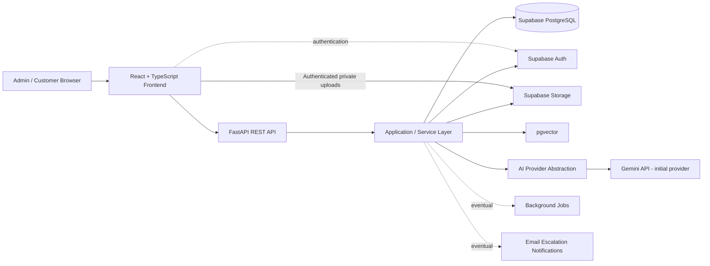
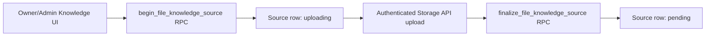
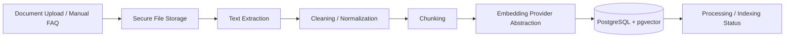
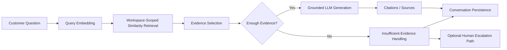
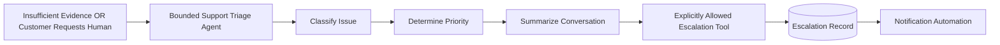
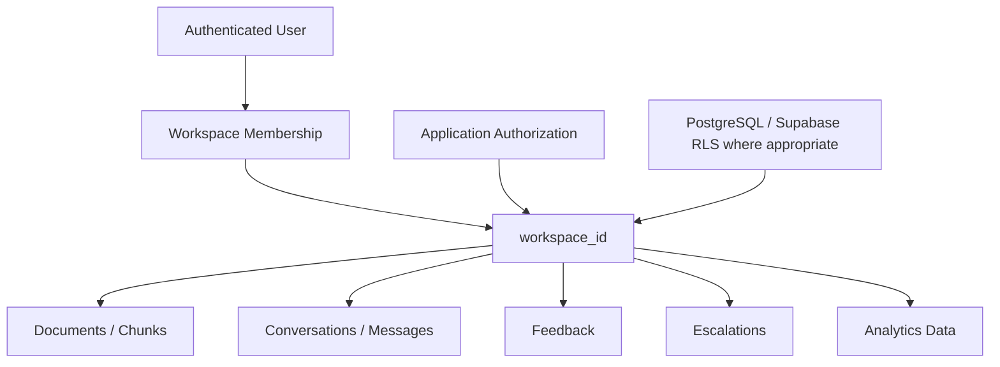

# SupportPilot AI — Architecture

## Architecture goals

SupportPilot AI should use a simple, maintainable architecture suitable for a professional portfolio project. The design must preserve strong tenant isolation, grounded RAG answers, replaceable AI providers, and a bounded agent model without introducing unnecessary enterprise complexity.

## High-level application architecture

### Responsibilities

- **React frontend:** admin and customer interfaces, client-side interaction, streaming response UX, and authenticated application flows.
- **FastAPI REST API:** trusted backend boundary for validation, authorization, orchestration, and external API behavior.
- **Application/service layer:** business rules, workspace scoping, RAG orchestration, document processing, conversation handling, escalation logic, and provider abstractions.
- **Supabase PostgreSQL:** relational application data.
- **Supabase Auth:** identity and authentication.
- **Supabase Storage:** uploaded source documents.
- **pgvector:** workspace-scoped vector storage and similarity retrieval.
- **AI provider abstraction:** isolates model-provider-specific generation and embedding logic so providers/models remain configurable and replaceable.
- **Background jobs:** introduced only when needed for document processing or other asynchronous work and only after rechecking a suitable free tier.
- **Email notifications:** introduced later for escalation automation only after verifying a suitable zero-cost option.

## Authentication and workspace foundation

Supabase Auth is the identity provider. A reusable frontend auth provider restores the Supabase-managed session, subscribes to auth changes, and protects `/app` routes without separately storing access tokens. Registration passes `display_name` as user metadata so the existing database trigger owns profile creation. Login, email-confirmation-required, and logout states are handled explicitly.

Browser code uses only the project URL and publishable key. After sign-in, the workspace provider reads `workspaces` through RLS and creates a workspace only through `create_workspace(workspace_name)`. A selected workspace ID may be stored locally for convenience, but it is always revalidated against the currently accessible RLS result and is never treated as authorization.

Authenticated FastAPI requests flow through one API client that applies the active session's bearer token. The backend authentication dependency:

- verifies ES256/RS256 tokens with the project's JWKS endpoint and cached signing keys;
- fixes the accepted algorithms, issuer, `authenticated` audience, expiration, and subject requirements;
- uses Supabase Auth's user endpoint with the publishable key for legacy HS256 projects that cannot be verified by JWKS;
- returns only the verified user ID and optional email from `/api/auth/me`.

No JWT signing secret is requested or stored. `SUPABASE_SECRET_KEY` remains reserved for future exceptional, narrowly scoped server operations and is not part of ordinary auth, workspace, or API request handling.

The initial Phase 2A data model contains only:

- `profiles`, keyed directly to `auth.users.id`;
- `workspaces`, with a recorded creator;
- `workspace_members`, with one `owner`, `admin`, or `member` role per user/workspace pair.

Every table has RLS enabled plus explicit grants and operation-specific policies. Private `SECURITY DEFINER` helpers check the caller's membership or owner role without recursively invoking membership policies. They derive identity from `auth.uid()`, use an empty fixed `search_path`, and expose no caller-supplied user-ID authority.

Workspace creation uses one narrowly scoped RPC. It validates the name, inserts the workspace, and creates the authenticated caller's owner membership atomically. Direct client writes to membership roles are not allowed in this phase.

## Knowledge-source storage foundation

Phase 3A introduces `knowledge_sources` as the workspace-owned record for uploaded files and manual FAQs. It records only source metadata/content needed at this stage—never uploaded binary data or embeddings. Statuses cover `uploading`, `pending`, `processing`, `ready`, and `failed`; Phase 3A creation flows stop at `pending` so the UI never implies that unprocessed material is ready for retrieval.

File uploads use this controlled sequence:

The database generates the creator, source UUID, status, and object path. Objects live in the private `knowledge-files` bucket under `<workspace-id>/<source-id>/<source-id>.<ext>`, are capped at 10 MB, and accept PDF, DOCX, TXT, or Markdown MIME types. Uploads use `upsert: false`; no Storage UPDATE policy exists, so object overwrite is unavailable.

Workspace owners and admins can initialize uploads, add FAQs, and remove failed-upload objects. Members can read permitted source metadata and private objects but cannot create, upload, update, or delete. Non-members have no access. Storage policies authorize an exact trusted source path through workspace membership rather than object ownership or caller-provided paths.

Failed uploads attempt Storage API cleanup before the narrowly scoped cancel RPC removes an `uploading` row. Cleanup checks both Supabase error results and thrown failures; metadata is never canceled unless object removal is explicitly confirmed. If finalization fails after a successful upload, the client makes exactly one recovery call and never reuploads or overwrites the object.

The recovery RPC accepts only a source UUID, derives workspace/status/path from a locked row, and authorizes the caller as that workspace's owner/admin. It checks only the exact trusted path in the private bucket. An existing object moves `uploading` to `pending`; an absent object removes only that stale row. An already-`pending` source with its exact object can be confirmed without mutation, making a lost finalize response idempotent. Other non-uploading states fail closed. Retained `uploading` rows expose a manager-only **Recover upload** action. General source deletion remains deferred because browser-side deletion across Storage and PostgreSQL cannot be made atomic without introducing a misleading partial-delete workflow.

## RAG ingestion flow

### Ingestion principles

- Processing must preserve `workspace_id` ownership.
- File type and input validation should happen before processing.
- Extracted text should be cleaned before chunking.
- Chunk metadata should retain enough source information to support later citations.
- Embeddings are generated through an abstraction layer; Gemini embeddings are the initial zero-cost default, not a permanent architectural dependency.
- Raw secrets or privileged storage credentials must never be exposed to the frontend.

## RAG question flow

### Question-answering principles

The normal support Q&A path is RAG, not an autonomous agent.

1. Embed the customer query.
2. Retrieve relevant chunks only from the correct workspace.
3. Select and evaluate evidence.
4. Determine whether available evidence is sufficient.
5. Generate only a grounded answer from approved evidence.
6. Return relevant source citations.
7. Persist the conversation and answer metadata.

When evidence is insufficient, the system should not fabricate an answer. It should return an appropriate fallback and offer or trigger escalation where applicable.

## Escalation agent flow

The Support Triage Agent is intentionally bounded. It may inspect only the conversation and context it is explicitly given and invoke only explicitly allowed escalation actions. It must not receive unrestricted database, shell, internet, or infrastructure access.

## Multi-tenancy and isolation

Major business-owned entities will use `workspace_id` so every business's content can be scoped consistently.

Workspace isolation must be enforced at multiple layers:

- application authorization and service-layer queries must scope access by `workspace_id`;
- retrieval must never search embeddings from another workspace;
- storage paths and document ownership should be workspace-aware;
- PostgreSQL/Supabase Row Level Security should be used where appropriate as defense in depth;
- privileged credentials must remain backend-only;
- tests should explicitly verify cross-workspace isolation.

## Provider abstraction

Generation and embeddings should be called through application interfaces rather than directly throughout feature code. Initial defaults are Gemini free-tier models, but configuration should make provider/model replacement possible without rewriting the RAG or application layers.

## Database scope

Phase 3A adds generalized knowledge-source metadata and private file storage to the Phase 2 profile/workspace foundation. Extracted content, chunks, embeddings, conversations, messages, feedback, escalations, analytics, and their associated indexes and policies remain deferred to later focused phases.
