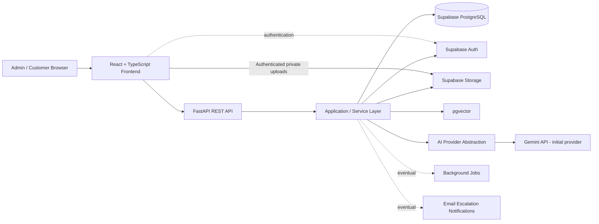
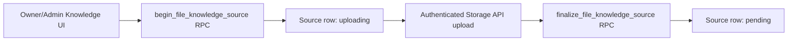
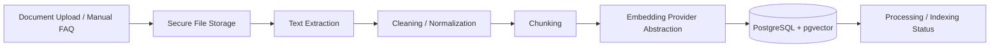
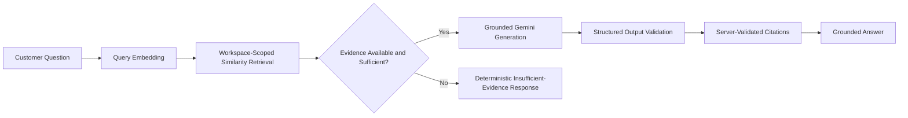
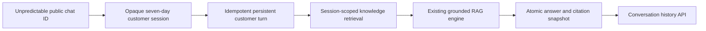
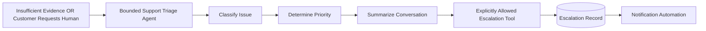
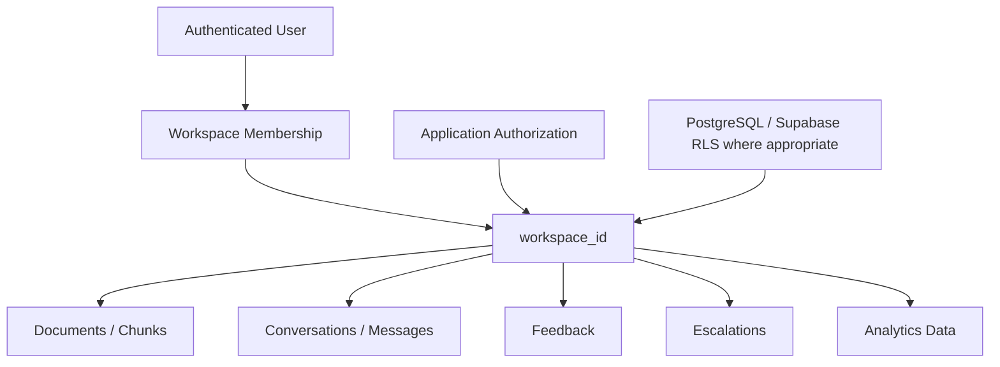

# SupportPilot AI — Architecture

## Architecture goals

SupportPilot AI should use a simple, maintainable architecture suitable for a professional portfolio project. The design must preserve strong tenant isolation, grounded RAG answers, replaceable AI providers, and a bounded agent model without introducing unnecessary enterprise complexity.

## High-level application architecture

### Responsibilities

- **React frontend:** admin and customer interfaces, client-side interaction, streaming response UX, and authenticated application flows.
- **FastAPI REST API:** trusted backend boundary for validation, authorization, orchestration, and external API behavior.
- **Application/service layer:** business rules, workspace scoping, RAG orchestration, document processing, conversation handling, escalation logic, and provider abstractions.
- **Supabase PostgreSQL:** relational application data.
- **Supabase Auth:** identity and authentication.
- **Supabase Storage:** uploaded source documents.
- **pgvector:** workspace-scoped vector storage and similarity retrieval.
- **AI provider abstraction:** isolates model-provider-specific generation and embedding logic so providers/models remain configurable and replaceable.
- **Background jobs:** introduced only when needed for document processing or other asynchronous work and only after rechecking a suitable free tier.
- **Email notifications:** introduced later for escalation automation only after verifying a suitable zero-cost option.

## Authentication and workspace foundation

Supabase Auth is the identity provider. A reusable frontend auth provider restores the Supabase-managed session, subscribes to auth changes, and protects `/app` routes without separately storing access tokens. Registration passes `display_name` as user metadata so the existing database trigger owns profile creation. Login, email-confirmation-required, and logout states are handled explicitly.

Browser code uses only the project URL and publishable key. After sign-in, the workspace provider reads `workspaces` through RLS and creates a workspace only through `create_workspace(workspace_name)`. A selected workspace ID may be stored locally for convenience, but it is always revalidated against the currently accessible RLS result and is never treated as authorization.

Authenticated FastAPI requests flow through one API client that applies the active session's bearer token. The backend authentication dependency:

- verifies ES256/RS256 tokens with the project's JWKS endpoint and cached signing keys;
- fixes the accepted algorithms, issuer, `authenticated` audience, expiration, and subject requirements;
- uses Supabase Auth's user endpoint with the publishable key for legacy HS256 projects that cannot be verified by JWKS;
- returns only the verified user ID and optional email from `/api/auth/me`.

No JWT signing secret is requested or stored. `SUPABASE_SECRET_KEY` is not part of ordinary auth, workspace, Knowledge Base, or business RAG request handling. Phase 5A uses it only inside a narrow server-side customer-chat RPC gateway because anonymous customers have no Supabase identity.

The initial Phase 2A data model contains only:

- `profiles`, keyed directly to `auth.users.id`;
- `workspaces`, with a recorded creator;
- `workspace_members`, with one `owner`, `admin`, or `member` role per user/workspace pair.

Every table has RLS enabled plus explicit grants and operation-specific policies. Private `SECURITY DEFINER` helpers check the caller's membership or owner role without recursively invoking membership policies. They derive identity from `auth.uid()`, use an empty fixed `search_path`, and expose no caller-supplied user-ID authority.

Workspace creation uses one narrowly scoped RPC. It validates the name, inserts the workspace, and creates the authenticated caller's owner membership atomically. Direct client writes to membership roles are not allowed in this phase.

## Knowledge-source storage foundation

Phase 3A introduces `knowledge_sources` as the workspace-owned record for uploaded files and manual FAQs. It records only source metadata/content needed at this stage—never uploaded binary data or embeddings. Statuses cover `uploading`, `pending`, `processing`, `ready`, and `failed`; Phase 3A creation flows stop at `pending` so the UI never implies that unprocessed material is ready for retrieval.

File uploads use this controlled sequence:

The database generates the creator, source UUID, status, and object path. Objects live in the private `knowledge-files` bucket under `<workspace-id>/<source-id>/<source-id>.<ext>`, are capped at 10 MB, and accept PDF, DOCX, TXT, or Markdown MIME types. Uploads use `upsert: false`; no Storage UPDATE policy exists, so object overwrite is unavailable.

Workspace owners and admins can initialize uploads, add FAQs, and remove failed-upload objects. Members can read permitted source metadata and private objects but cannot create, upload, update, or delete. Non-members have no access. Storage policies authorize an exact trusted source path through workspace membership rather than object ownership or caller-provided paths.

Failed uploads attempt Storage API cleanup before the narrowly scoped cancel RPC removes an `uploading` row. Cleanup checks both Supabase error results and thrown failures; metadata is never canceled unless object removal is explicitly confirmed. If finalization fails after a successful upload, the client makes exactly one recovery call and never reuploads or overwrites the object.

The recovery RPC accepts only a source UUID, derives workspace/status/path from a locked row, and authorizes the caller as that workspace's owner/admin. It checks only the exact trusted path in the private bucket. An existing object moves `uploading` to `pending`; an absent object removes only that stale row. An already-`pending` source with its exact object can be confirmed without mutation, making a lost finalize response idempotent. Other non-uploading states fail closed. Retained `uploading` rows expose a manager-only **Recover upload** action. General source deletion remains deferred because browser-side deletion across Storage and PostgreSQL cannot be made atomic without introducing a misleading partial-delete workflow.

## RAG ingestion flow

Phase 3B implements deterministic extraction and chunk storage. Phase 3C completes ingestion with provider-abstracted embeddings and atomic pgvector indexing. Both protected FastAPI endpoints accept only a source UUID. The internal auth context retains the already-verified user access token without serializing, logging, or persisting it. A narrow gateway calls lifecycle RPCs using the publishable key plus that user's bearer token; no secret-key client is used.

`begin_knowledge_extraction` locks the source, derives its workspace, authorizes an owner/admin, moves `pending` or `failed` to `processing`, and rejects a second request unless the prior attempt is over 15 minutes old. File bytes are held in memory and hard-limited to 10 MB. PDFs require a valid signature, are rejected when encrypted or over 300 pages, and preserve 1-based page locators. OCR is not included, so scanned/image-only PDFs fail with no extractable text. DOCX parsing first validates the ZIP container (2,000 entries, 50 MB total expansion, 20 MB per member), rejects traversal, encrypted/macro/embedded-active content and XML entity declarations, then extracts paragraphs and tables in structural order. TXT/Markdown are UTF-8-only and preserve line ranges. FAQs use canonical question/answer text without Storage access.

Normalization uses Unicode NFC, stable newline/whitespace handling, control-character removal, and preserved block boundaries. Deterministic character/paragraph-aware chunking targets 1,400 characters, caps chunks at 2,000 characters (below the 2,200-character database ceiling), and uses up to 180 characters of overlap when it fits. Oversized blocks prefer sentence and word boundaries before a hard character split. Every chunk receives a zero-based index, lowercase SHA-256 digest, exact character count, and an aggregated locator: PDF pages, DOCX structural blocks, text/Markdown lines, or FAQ kind.

`complete_knowledge_extraction` validates the entire JSON chunk set before atomically replacing prior chunks and returning the source to `pending`; that state means extracted and awaiting indexing. Phase 3C's indexing RPC locks the source, returns the complete trusted chunk set in order, and records an explicit indexing stage. Gemini Embedding 2 receives only normalized text and title metadata formatted according to its current retrieval-document guidance, in bounded batches, with 768-dimensional responses checked for count, type, finiteness, and size. Completion rechecks every chunk SHA-256 token and atomically writes all vectors plus the `ready` source metadata. `ready` means all current chunks were successfully embedded. Any failure retains the extracted chunks and uses an indexing-only retry path. Workspace members may read chunks through RLS, while browser roles cannot read or modify raw embeddings.

### Ingestion principles

- Processing must preserve `workspace_id` ownership.
- File type and input validation should happen before processing.
- Extracted text should be cleaned before chunking.
- Chunk metadata should retain enough source information to support later citations.
- Embeddings are generated through an abstraction layer; Gemini embeddings are the initial zero-cost default, not a permanent architectural dependency.
- Raw secrets or privileged storage credentials must never be exposed to the frontend.

## RAG question flow

Phase 4A implements the retrieval steps. The provider abstraction formats document chunks as `title: {title} | text: {content}` and questions as `task: question answering | query: {question}` for Gemini Embedding 2, with both sides fixed at 768 dimensions. The protected `/api/rag/retrieve` diagnostic endpoint normalizes a 2–2,000 character question, embeds it once, and calls a single user-JWT-scoped Supabase RPC.

The SQL function verifies workspace membership before searching and includes workspace, `ready` status, non-null vector, provider, model, and dimension compatibility in the ranked query itself. It orders by cosine distance using the existing HNSW index, defaults to eight matches, caps requests at twelve, and returns `1 - cosine_distance` with citation-ready content and unchanged locators. Raw embeddings remain outside the response and ordinary column grants. No answerability threshold is hard-coded because later RAG evaluation must calibrate it; Phase 4B owns evidence evaluation and grounded generation.

Phase 4B adds the protected `/api/rag/answer` endpoint without changing retrieval semantics. It calls the Phase 4A service exactly once, immediately returns a fixed insufficient-evidence message when no chunks exist, and otherwise labels ranked chunks `E1` through `E8`. Only the normalized question and at most 20,000 characters of evidence content plus minimal source metadata are passed to the replaceable generation-provider interface.

The initial implementation uses Gemini `gemini-3.8-flash` with low thinking, a 1,200-token output limit, and a Pydantic structured-output schema. Retrieved documents and the user question are serialized as JSON and explicitly treated as untrusted data. The model receives no tools, function calling, Google Search grounding, URL context, database access, or raw embeddings. Prompt-injection resistance is defense in depth rather than a mathematical guarantee.

The model may return only `answerable` with a bounded answer and request-local evidence labels, or `insufficient_evidence` with no answer or labels. No fixed cosine threshold is used: when matches exist, the model evaluates their actual content rather than answering from general knowledge. The server validates every returned label, removes duplicate references deterministically, restores retrieval order, and constructs citation titles, types, indices, UUIDs, and locators solely from trusted retrieval results. Unknown labels or malformed structured output fail safely; the model never supplies final citation metadata. Phase 5A reuses this same orchestration for anonymous customer turns.

## Customer conversation flow

Phase 5A introduces one enabled chat configuration per workspace, SHA-256-only customer-session records, conversations, idempotent turns, customer/assistant messages, and historical citation snapshots. FastAPI generates at least 256 bits of token entropy, returns the raw token only once, hashes it immediately on later requests from `X-SupportPilot-Session`, and never stores or logs the raw value. A conversation is limited to 100 customer turns; messages, answers, citations, and retrieval counts are bounded. Sessions remain anonymous and collect no name, email, phone, IP address, location, or browser fingerprint. Robust public abuse/rate limiting remains Phase 8 work.

The two security paths remain deliberately separate:

- Business/admin operations use a Supabase user JWT, the publishable key, and RLS.
- Anonymous customer operations use an opaque customer session through FastAPI, a fixed allow-list customer-chat gateway, and server-only RPCs invoked with `SUPABASE_SECRET_KEY`.

The secret key bypasses RLS, so it never reaches browser code and cannot be used through a generic privileged client. Direct table privileges are withheld even from the service role. Every public-chat RPC independently derives and validates the session/workspace relationships relevant to its operation, and returns only its bounded safe result. The original member-authorized `search_knowledge_chunks` RPC is unchanged; a separate server-only retrieval RPC derives the workspace from the validated customer session and never returns vectors.

The turn-start RPC creates the processing turn and normalized customer message atomically. Its `(conversation_id, client_message_id)` uniqueness prevents duplicate customer messages and generation: completed retries return the persisted answer, processing retries return a safe conflict, and failed turns can retry without deleting their customer message. The completion RPC validates citation data against current trusted workspace chunks before atomically writing an assistant message, citation snapshots, links, and timestamps. Provider exception details are never persisted.

Phase 5B.1 adds the public `/chat/:publicId` React route outside the business authentication boundary. A dedicated frontend API client calls only session creation, conversation history, and turn submission through FastAPI; the opaque token is sent only through `X-SupportPilot-Session`. A public-ID-namespaced local-storage record contains only public ID, conversation ID, session token, expiry, and workspace name. Messages are always restored from server history rather than cached locally. Expired or rejected sessions are cleared and recreated once, while ambiguous turn failures retain the original `client_message_id` for an explicit Retry action.

The hosted UI renders all customer, assistant, and citation text as plain text. Citation locations support PDF pages, DOCX blocks, text/Markdown lines, and FAQs without inventing source URLs. Phase 5 remains non-streaming; conversation-aware context, feedback, and human-request experience are still deferred.

### Question-answering principles

The normal support Q&A path is RAG, not an autonomous agent.

1. Embed the customer query.
2. Retrieve relevant chunks only from the correct workspace.
3. Select and evaluate evidence.
4. Determine whether available evidence is sufficient.
5. Generate only a grounded answer from approved evidence.
6. Return relevant source citations.
7. Persist the conversation and answer metadata through the Phase 5A customer-chat flow.

When evidence is insufficient, the system should not fabricate an answer. It should return an appropriate fallback and offer or trigger escalation where applicable.

## Escalation agent flow

The Support Triage Agent is intentionally bounded. It may inspect only the conversation and context it is explicitly given and invoke only explicitly allowed escalation actions. It must not receive unrestricted database, shell, internet, or infrastructure access.

## Multi-tenancy and isolation

Major business-owned entities will use `workspace_id` so every business's content can be scoped consistently.

Workspace isolation must be enforced at multiple layers:

- application authorization and service-layer queries must scope access by `workspace_id`;
- retrieval must never search embeddings from another workspace;
- storage paths and document ownership should be workspace-aware;
- PostgreSQL/Supabase Row Level Security should be used where appropriate as defense in depth;
- privileged credentials must remain backend-only;
- tests should explicitly verify cross-workspace isolation.

## Provider abstraction

Generation and embeddings should be called through application interfaces rather than directly throughout feature code. Initial defaults are Gemini free-tier models, but configuration should make provider/model replacement possible without rewriting the RAG or application layers.

## Database scope

Phase 3C completes ingestion with explicit lifecycle metadata, replaceable embeddings, 768-dimensional pgvector storage, and one cosine HNSW index. Phase 4 adds authenticated workspace-scoped semantic retrieval, evidence-sufficiency decisions, grounded structured generation, and server-validated citations. Phase 5A adds `workspace_chat_configs`, `customer_sessions`, `conversations`, `conversation_turns`, `messages`, and `message_citations` plus narrowly granted customer-chat RPCs. Feedback, escalations, and analytics remain deferred.
