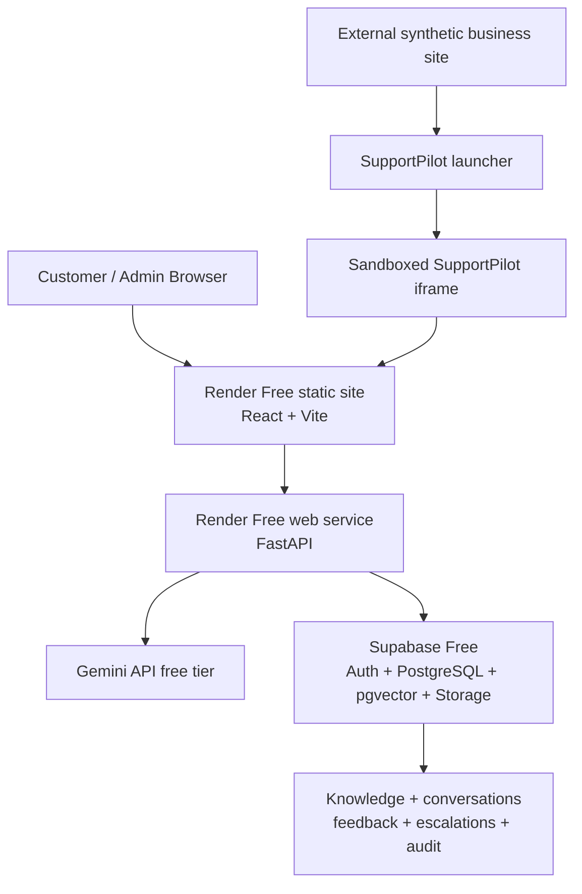

# SupportPilot AI — Portfolio Handoff

## 1. One-line project title

**SupportPilot AI — Secure full-stack RAG customer support with trusted citations and bounded agent automation**

## 2. Elevator pitch

SupportPilot AI turns a business's own support knowledge into grounded, streaming customer answers with citations that are reconstructed from trusted retrieval metadata. It combines a multi-tenant React/FastAPI application, Supabase and pgvector, Google Gemini, an embeddable widget, and a deliberately bounded triage agent, with security and quality claims backed by separate database, API, browser, and RAG evaluations.

## 3. Full project description

SupportPilot AI is a deployable personal portfolio application that demonstrates production-minded GenAI engineering without claiming commercial usage. Workspace owners and admins can authenticate, ingest FAQs and supported documents, process and index them, inspect conversations, review feedback, manage escalations, and track explicit resolution outcomes. Customers use either a hosted chat or a CSS-isolated widget embedded on an external site.

The normal answer flow is retrieval-augmented generation rather than a generic chatbot. FastAPI embeds a workspace-scoped question, retrieves pgvector evidence through Row Level Security, evaluates whether the evidence is sufficient, asks Gemini for validated structured output, rebuilds citations from server-owned metadata, streams the completed decision over Server-Sent Events, and persists the conversation. If evidence is insufficient, the application returns controlled wording instead of inventing a policy. A separate bounded triage workflow can classify unresolved conversations and create an escalation through one allow-listed tool.

The public baseline runs on zero-cost free tiers. Its test strategy keeps pytest, frontend unit/component tests, Playwright journeys, hosted pgTAP security assertions, and RAG evaluation results separate so each claim remains auditable.

## 4. Core problem solved

Customer-support chat systems are useful only when answers stay within the correct business knowledge, cite real sources, respect tenant boundaries, and hand uncertain cases to people. SupportPilot AI demonstrates that complete workflow: knowledge ingestion, scoped retrieval, grounded responses, explicit uncertainty, customer feedback, durable handoff, and administrator operations.

## 5. Major features

- Supabase authentication, role-aware navigation, and isolated workspaces.
- FAQ plus PDF, DOCX, Markdown, and UTF-8 text ingestion with validation and private Storage.
- Workspace-scoped semantic retrieval using Gemini Embedding 2 and 768-dimensional pgvector data.
- Structured Gemini generation, real SSE delivery, conversation context, idempotent retries, and server-owned citations.
- Safe insufficient-evidence responses, feedback, customer history, and confirmed human handoff.
- Dashboard, knowledge status, conversation review, escalation workflows, feedback, and explicit resolve/reopen lifecycles.
- Dependency-free widget launcher with a sandboxed, separately hosted iframe.
- Atomic public rate limits and consistent safe API errors.
- Bounded escalation triage with durable audit, retry, and optional notification state.
- GitHub Actions CI and a zero-cost Render/Supabase/Gemini public baseline.

## 6. GenAI/RAG architecture

The customer question path is:

1. Validate the public workspace ID, customer session, request size, content type, and rate limit.
2. Normalize the current question and bounded recent conversation context.
3. Create an embedding through a replaceable provider interface.
4. Retrieve only the current workspace's eligible chunks through pgvector and authenticated database controls.
5. Build a bounded evidence context with server-owned source IDs and locators.
6. Request structured generation from Gemini with no web search, shell, URL context, or general tool access.
7. Validate answerability and every cited evidence ID before releasing answer text.
8. Reconstruct citation titles, types, chunk indexes, and locators from retrieval metadata.
9. Stream safe events and atomically persist only the completed answer or controlled insufficiency result.

Generation and embedding providers are isolated behind application interfaces so the architecture is not spread across provider-specific code. The deterministic evaluation uses a fictional corpus and scripted SDK responses; live embedding and hosted pgvector measurements are reported separately.

## 7. Agentic AI component

The Support Triage Agent is intentionally narrower than the RAG answer path. It analyzes a durable unresolved escalation, returns validated category, priority, and summary fields, and has exactly one declared action: `create_escalation`. The model cannot browse, run shell commands, send email, edit arbitrary records, or access infrastructure. PostgreSQL owns claiming, attempt fencing, retries, and audit state; application code owns trusted IDs and all database effects.

This is agentic because the workflow evaluates unresolved state and chooses a constrained, tool-backed escalation action. It is not an unrestricted autonomous agent, and normal customer answers do not use it.

## 8. Security architecture

- Row Level Security and authenticated PostgreSQL functions enforce workspace membership and role boundaries.
- Normal authenticated requests use the caller's JWT and publishable Supabase key rather than bypassing RLS.
- The Supabase secret key is server-only and restricted to narrowly scoped public-chat persistence operations.
- Public endpoints validate identifiers, sessions, input sizes, content types, expected lifecycle state, and quotas.
- Rate limits are atomic and database-owned; rejected starts occur before AI work.
- Customer and operational state stays inside the SupportPilot iframe; the external host receives no transcript or credential.
- Private uploads receive size, format, archive, page-count, and extraction safeguards.
- API errors are mapped to stable safe envelopes; secrets and confidential document contents are not intentionally logged.
- Tracked configuration contains variable names only. Real credentials belong in local environment files or deployment secret stores.

The security model is extensively tested but is not presented as a formal certification or a guarantee of perfect security.

## 9. Testing and evaluation proof

| Category | Verified release baseline |
| --- | --- |
| Backend | 586 pytest tests; Ruff lint and format checks |
| Frontend | 204 Vitest/React Testing Library tests; ESLint; TypeScript/Vite production build |
| Browser integration | 24 deterministic Chromium Playwright tests |
| Hosted database security | 16 transactional pgTAP suites; 1,004 assertions; no suite skipped |
| RAG evaluation | 36 synthetic cases; deterministic Hit@8 100%, Recall@8 98.39%, answerability 100%, citation validity 100%, no fixture cross-workspace leakage |
| Live retrieval boundary | 36 queries with Gemini embeddings and hosted pgvector; Hit@8 and Recall@8 100%; no cross-workspace retrieval leak; fixture rollback passed |

These categories use different environments and must not be combined into one test count. The live retrieval run did not score generation. The later production smoke was deliberately small and verified one grounded supported answer plus one controlled unsupported answer; it is not a broad model-quality benchmark.

## 10. Deployment architecture

The Render Blueprint contains one API service and two static sites. It adds no Render database, persistent disk, queue, paid worker, custom domain, or keep-alive. Render Free cold starts are an accepted portfolio limitation.

## 11. Technology stack

- **Frontend:** React 19, TypeScript, React Router, Vite, Tailwind CSS.
- **Backend:** Python 3.12+, FastAPI, Pydantic, Uvicorn, HTTPX.
- **Platform:** Supabase Auth, PostgreSQL, private Storage, pgvector, SQL migrations, pgTAP.
- **AI:** Google Gemini generation and Gemini Embedding 2 behind replaceable interfaces.
- **Quality:** pytest, Ruff, Vitest, React Testing Library, ESLint, Playwright, deterministic RAG evaluation.
- **Delivery:** Git, GitHub Actions, Render Blueprint.

## 12. Key engineering challenges solved

- Kept model-visible evidence bounded while rebuilding citations from trusted source metadata.
- Preserved workspace isolation across authenticated admin flows, anonymous customer sessions, retrieval, and operational data.
- Streamed useful UI events without persisting partial answers or turning failed generations into misleading history.
- Made retries idempotent across customer turns, rate limits, escalation claims, and optional notifications.
- Embedded the same customer experience on a genuinely separate origin without leaking state to the host page.
- Separated deterministic, hosted-database, live-retrieval, and production-smoke evidence so each result has an honest scope.
- Delivered a credible public demo under a strict ₹0 / $0 infrastructure and AI-cost target.

## 13. Honest limitations

- Render Free services can cold-start after inactivity and have no uptime or latency SLA.
- The public demo uses synthetic content and has not served real customers or confidential documents.
- Free AI tiers have quotas and terms that may change; only non-confidential synthetic data should be used.
- RAG evaluation is intentionally small, domain-specific, and partly deterministic; its scores do not prove universal accuracy.
- The bounded production smoke is not a capacity, load, accessibility-certification, penetration-test, or broad live-model benchmark.
- Semantic score ranges overlap, so the current evidence decision should continue to be evaluated as corpora change.
- Shared public widget identifiers, compromised browser keys/XSS, aggregate abuse controls, CSP validation, and storage byte-deletion guarantees remain documented operational risks.
- Optional notification email remains disabled unless a suitable free verified sender setup is supplied.

## 14. Public demo URLs

- Application: <https://supportpilot-web-6w61.onrender.com>
- External widget: <https://supportpilot-widget-demo.onrender.com>
- API health: <https://supportpilot-api-ytih.onrender.com/api/health>

Allow a short wake-up period after inactivity because the services use Render Free.

## 15. GitHub repository URL

<https://github.com/TheVJ0000/SupportPilot-AI>

Source code, migrations, tests, evaluation fixtures, architecture decisions, deployment notes, and security limitations are public in the repository.

## 16. Interview talking points

### What does SupportPilot AI do?

It turns a workspace's own support documents and FAQs into grounded customer answers, shows trusted citations, stores the conversation, gathers feedback, and hands uncertain or requested cases to support staff. Admins can manage the knowledge base, conversations, outcomes, and escalations; customers can use a hosted chat or external-site widget.

### How does RAG work here?

FastAPI embeds the current question, retrieves top workspace-scoped chunks from pgvector, builds a bounded evidence context, and asks Gemini for a structured answerability decision and answer. The server validates the result, reconstructs citations from retrieved records, streams the response, and persists only the completed turn.

### What makes this agentic?

The escalation triage workflow inspects unresolved durable state and can select one constrained `create_escalation` action with validated category, priority, and summary. Its tool set and data access are deliberately narrow. Customer Q&A remains a predictable RAG pipeline rather than an autonomous agent.

### Why did you use pgvector?

It keeps vectors beside tenant-scoped source metadata in PostgreSQL, allowing semantic retrieval and authorization to share transactions, RLS, migrations, and operational tooling. That simplicity suits a portfolio-scale system and avoids another paid service.

### How do citations remain trustworthy?

The model may reference only evidence IDs supplied for that request. The backend validates those IDs, rejects foreign or absent references, and rebuilds the displayed title, type, locator, and chunk index from server-owned retrieval metadata. It never trusts the model to invent citation details.

### How do you prevent cross-workspace data leakage?

Workspace membership and roles are enforced in RLS and authenticated database functions; retrieval takes verified workspace context; storage paths are private; public IDs map through controlled customer-session flows; and both hosted pgTAP attacks and deterministic evaluation include foreign-workspace controls.

### What happens when AI does not know the answer?

When retrieved evidence is insufficient or the structured result fails validation, the application returns fixed safe wording with no citations rather than inventing a policy. That state can create or reuse a durable escalation while leaving customer history consistent.

### How does human escalation work?

A confirmed customer request pauses additional AI replies and atomically creates or reuses an escalation. The bounded triage worker classifies it under fenced retries, admins manage explicit escalation and conversation lifecycles, and optional email notification is isolated behind a durable outbox.

### What security testing did you perform?

The release uses backend authorization and parsing regressions, 16 hosted transactional pgTAP suites with 1,004 assertions, real PostgreSQL concurrency races, 24 Playwright browser journeys, bundle secret-marker checks, repository secret review, and workspace-isolation cases in the RAG evaluation.

### What are the current limitations?

It is a synthetic portfolio deployment on free tiers: cold starts and quotas are expected, no SLA or real-customer adoption is claimed, the evaluation corpus is small, optional email is not generally enabled, and documented defense-in-depth items such as a verified CSP and broader abuse/load testing remain future work.

## 17. Suggested top skills

1. Retrieval-Augmented Generation (RAG)
2. FastAPI and Python
3. React and TypeScript
4. PostgreSQL, Supabase, and pgvector
5. Generative AI security and evaluation

## Upwork Portfolio Copy

### Project title

SupportPilot AI — Secure RAG Customer Support Platform

### Short description

Built a full-stack GenAI support platform with React, FastAPI, Supabase, pgvector, and Gemini. It delivers workspace-scoped RAG, SSE answers, trusted citations, feedback and handoff, a bounded triage agent, admin operations, an embeddable widget, and separate security, browser, and RAG validation in CI.

### Full portfolio description

SupportPilot AI is a public customer-support portfolio application demonstrating production-minded GenAI and full-stack engineering. Teams can create isolated workspaces, ingest FAQs and supported documents, index knowledge with Gemini Embedding 2, and manage conversations, feedback, escalations, and resolution outcomes.

Customer questions run through a workspace-scoped RAG pipeline: FastAPI retrieves pgvector evidence, evaluates support, requests structured Gemini generation, validates every evidence reference, rebuilds citations from trusted server metadata, streams the response with Server-Sent Events, and persists only completed turns. Unsupported questions receive controlled wording and can enter a durable human-escalation workflow. A separate bounded triage agent has one allow-listed action and no open-ended database, internet, or infrastructure access.

The React/TypeScript experience includes hosted chat, role-aware admin views, and a CSS-isolated widget running inside a sandboxed external-origin iframe. Security is backed by Supabase RLS, authenticated SQL functions, atomic quotas, input controls, hosted pgTAP suites, and browser isolation tests. Quality evidence is reported separately across 586 pytest tests, 204 frontend tests, 24 Playwright journeys, 1,004 hosted pgTAP assertions, and a 36-case RAG benchmark. The zero-cost public baseline runs on Render and Supabase free tiers. Source code and technical documentation are available in the public repository.

### Top 5 skills

1. Retrieval-Augmented Generation (RAG)
2. Python / FastAPI
3. React / TypeScript
4. Supabase / PostgreSQL / pgvector
5. Gemini API and AI evaluation

### Suggested category and keywords

**Category:** AI Apps & Integration / Full-Stack Development

**Keywords:** Generative AI, RAG, AI chatbot, FastAPI, React, TypeScript, Supabase, PostgreSQL, pgvector, Gemini, SSE, multi-tenant SaaS, AI agent, Playwright.

### Call to action

If you need a grounded AI workflow, secure multi-tenant application, or evidence-backed RAG prototype, review the live demo and repository, then contact me to discuss the data, integrations, evaluation plan, and deployment constraints for your project.

## LinkedIn Project Copy

### Project name

SupportPilot AI — Full-Stack RAG Support Platform

### Concise description

Personal portfolio project: a React/FastAPI customer-support platform using Supabase, pgvector, and Gemini for workspace-scoped RAG, structured streaming answers, trusted citations, safe insufficiency, feedback, and human handoff. It also includes a deliberately bounded triage agent, admin operations, an external-origin widget, hosted database security tests, Playwright journeys, and dedicated RAG evaluation. Built and publicly deployed on free tiers with limitations documented rather than hidden.

### Top 5 skills

Retrieval-Augmented Generation (RAG) · FastAPI · React/TypeScript · PostgreSQL/pgvector · Generative AI evaluation

### Links

- Live demo: <https://supportpilot-web-6w61.onrender.com>
- Repository: <https://github.com/TheVJ0000/SupportPilot-AI>

### GenAI and agentic-AI positioning

The primary customer-answer path is evidence-grounded RAG. Agentic behavior is reserved for the narrow triage workflow, where one validated tool can create an escalation; it is not used as a marketing label for ordinary chat completion.

## Resume Project Copy

- Engineered a full-stack multi-tenant support platform with React, TypeScript, FastAPI, Supabase Auth/PostgreSQL/Storage, pgvector, and Google Gemini, deployed publicly on Render free services.
- Implemented workspace-scoped RAG using 768-dimensional Gemini embeddings, structured generation, SSE streaming, server-rebuilt citations, safe insufficiency, idempotent customer turns, feedback, and human handoff.
- Designed a bounded triage agent with one allow-listed escalation tool, validated outputs, durable PostgreSQL claiming/retry/audit state, and no unrestricted database, shell, or internet access.
- Secured tenant and public flows with RLS, authenticated database functions, private storage, atomic rate limits, lifecycle conflict controls, safe errors, and isolated iframe embedding.
- Validated the release with 586 pytest tests, 204 Vitest/RTL tests, 24 Playwright browser journeys, 1,004 hosted pgTAP assertions, and a 36-case deterministic RAG benchmark in GitHub Actions.

## Release and version decision

The stable portfolio baseline is identified by the annotated Git tag `v1.0.0`. The internal frontend and backend package metadata remains `0.1.0` because neither component is published independently as an npm or Python package; changing those values would not improve deployment or consumer compatibility. Future application releases should use new commits and tags without rewriting `v1.0.0`.
